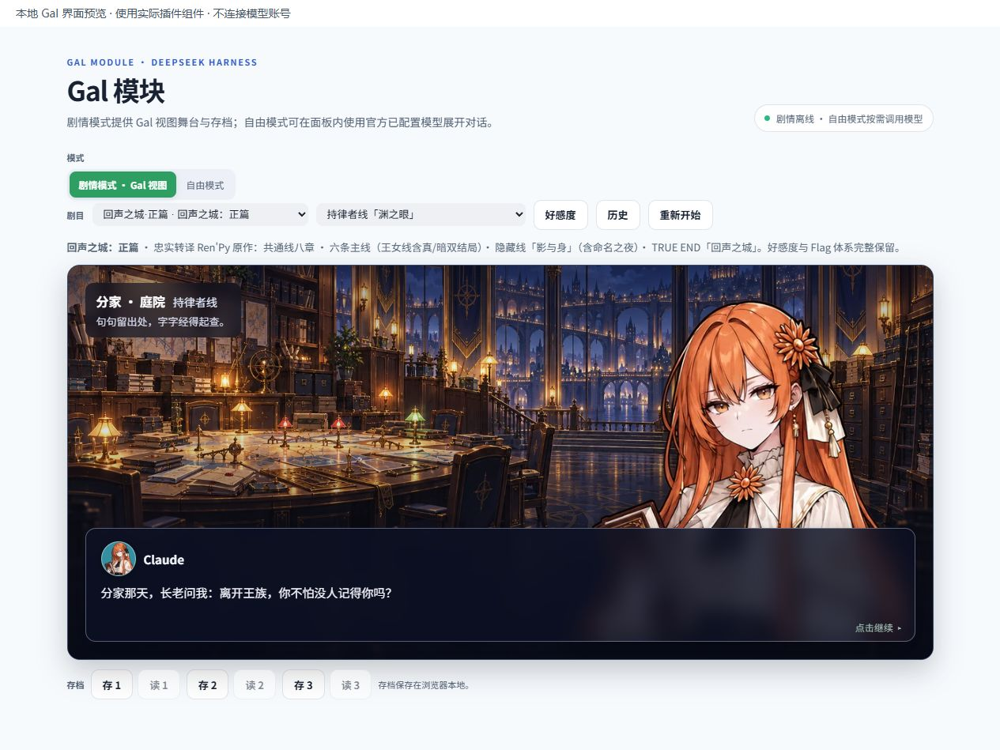

# DeepSeek Harness Desktop 插件安装与验证

**0.10.1 通过 npm `next` 通道与 GitHub v0.10.1 预发布提供；0.9.0 是此前发布版本。** 两者均声明适配官方 DeepSeek Harness Desktop **0.2.0-rc.1**。要体验五部 Gal 剧目与最新立绘，请在插件管理器填 **`@ljwei-stak/model-router-galgame@0.10.1`**，或安装 Release 中的 `.tgz`。npm 的旧 `latest` 标签仍为 0.4.32，须指定完整版本号。0.10.1 已通过本地回归与组件预览，但用户的官方桌面安装和真实账号调用仍需验收。

## 版本与宿主对应关系

| 插件版本 | 发布渠道 | 声明的 DeepSeek Harness 依赖 | 安装建议 |
| --- | --- | --- | --- |
| **0.10.1** | npm `next`、GitHub v0.10.1 预发布 | `0.2.0-rc.1` | 五部剧目、28 原稿基础图与 162 表情差分；指定 `@0.10.1` 或下载 `.tgz`，等待用户桌面验收。 |
| **0.9.0** | 已发布的 npm 包、GitHub v0.9.0 预发布 | `0.2.0-rc.1` | 旧兼容版；须显式指定 `@0.9.0`，不含本轮新增 Gal 内容。 |
| 0.8.0 | 历史发布 | `0.1.7-rc.2` | 与桌面版 0.2.0-rc.1 不兼容。 |
| 0.4.32 | npm `latest` | `@deepseek-ai/dsh-settings` 的 `^0.1.1-rc.1 || ^0.1.2-rc.1 || ^0.1.5-rc.1` | 历史版本；不适用于当前桌面版 0.2.0-rc.1。 |

表中列的是包声明的兼容依赖，并非对所有旧桌面版本的实机验收。先在 DeepSeek Harness 的插件页确认宿主版本；安装 0.10.1 时不要只输入不带版本的包名，以免选到旧包。

## 安装 0.10.1

1. 打开官方 DeepSeek Harness Desktop 的 **插件 → 添加插件**，在输入框粘贴：

   ```text
   @ljwei-stak/model-router-galgame@0.10.1
   ```

   安装源选择 **`https://registry.npmjs.org/`**；中国大陆镜像可能需要等待版本同步。无需先运行 `npm install -g`，全局安装不会在当前 Desktop profile 注册插件。
2. 若需文件安装，从 [GitHub v0.10.1 Release](https://github.com/Alice-Marx/model-router-galgame/releases/tag/v0.10.1) 下载 `ljwei-stak-model-router-galgame-0.10.1.tgz` 和 `.sha256` 文件，保存到自选目录。在输入框改填下载文件的**绝对路径**，例如 `D:\Plugins\ljwei-stak-model-router-galgame-0.10.1.tgz`。用以下命令核对 Release 校验文件（替换成实际路径）：

   ```powershell
   Get-FileHash -Algorithm SHA256 -LiteralPath 'D:\Plugins\ljwei-stak-model-router-galgame-0.10.1.tgz'
   ```

   本地文件安装无需 npm 镜像源，也可保留下载包后再次安装。
3. 确认插件详情显示 **0.10.1** 且无宿主不兼容提示，点击安装并启用；若提示重启则重启。已装旧版时，先在插件页禁用重复的旧实例。左侧应出现 **模型路由** 和 **Gal 模块**。不要手工改动应用安装目录、`app.asar` 或 profile 文件。
4. 进入 **Gal 模块 → 剧情模式 · Gal 视图**，核对五个剧目和立绘。安装后的逐项验证见下方清单；这一步仍须用户在官方桌面实装确认。

## 安装此前已发布的 0.9.0（历史版）

以下方法均在官方桌面版的 **插件 → 添加插件** 中操作。安装完成后启用插件；若页面提示重启后生效，则重启 DeepSeek Harness。已装旧版本时，先在插件页禁用重复的旧实例，再安装指定版本。不要手工改动应用安装目录、`app.asar` 或 profile 文件。

### 方法一：从 npm 安装

在“包名或地址”中完整填写：

```text
@ljwei-stak/model-router-galgame@0.9.0
```

“安装源”选择可以连通的 **npm 官方源**；若网络无法访问，可按插件管理器提示改选中国大陆镜像源，但镜像需要已同步 0.9.0。确认预览显示 **0.9.0** 且没有宿主依赖不兼容提示，再点“安装”。普通用户不需要在系统终端运行 `npm install -g`：全局安装 npm 包不会自动把插件加入当前 DeepSeek Harness profile。

### 方法二：安装 GitHub Release 的固定安装包

从 [GitHub v0.9.0 预发布](https://github.com/Alice-Marx/model-router-galgame/releases/tag/v0.9.0)下载 `ljwei-stak-model-router-galgame-0.9.0.tgz`，保存到你选择的目录。然后在“包名或地址”中填写**下载后文件的绝对路径**，例如：

```text
D:\Plugins\ljwei-stak-model-router-galgame-0.9.0.tgz
```

这里的 `D:\Plugins\` 只是示例，实际输入须与文件所在位置一致。官方插件管理器支持本地 `.tgz` 路径。发布包的 SHA-256 为 `FB06ED5527DE256062BB932EF5A35AF8FF9BEB8B6D2B3F635E2F30D0736A8E4B`；需要核对下载文件时，可在 PowerShell 运行 `Get-FileHash -Algorithm SHA256 -LiteralPath "D:\Plugins\ljwei-stak-model-router-galgame-0.9.0.tgz"`（按实际路径替换）。

### 方法三：从源码自行打包（开发者可选）

在已安装 Node.js 22.19 或更新版本与 pnpm 的环境中，检出 `v0.9.0` 后执行：

```powershell
git clone https://github.com/Alice-Marx/model-router-galgame.git
Set-Location model-router-galgame
git checkout v0.9.0
pnpm install --frozen-lockfile
npm run build:client
New-Item -ItemType Directory -Force dist | Out-Null
npm pack --pack-destination dist
```

随后按方法二，在插件管理器中填写生成的 `dist\ljwei-stak-model-router-galgame-0.9.0.tgz` **绝对路径**并安装。源码安装需能下载开发依赖；仅想使用插件时优先选择方法一或二。

## 0.10.1 的五部 Gal 剧目与存档

安装 0.10.1 后，剧情模式的剧目下拉框应显示 **千桥协议、旧城迁移篇、雪灯来信、未寄出的春天、回声之城·正篇**。《雪灯来信》是五章、两结局的**独立短篇**；《未寄出的春天》是十二章、九条可选支线、五结局的**独立后日谈**；《回声之城·正篇》含序章、共通八章、六条主线、隐藏线与 TRUE END，**只有王女线有真／暗双结局**。详细剧情与路线见 [Gal 五剧目玩法说明](docs/ECHO_CITY_STORY.zh.md)。

各剧目有独立自动进度及三个手动槽。旧剧目、短篇和春篇**章节直入会重置此前选择**；正篇按章节继续时保留本周目的旗标与好感度。春篇修订版 1 旧存档可读，新增的“双份原件”“逐人询问”旗标不会凭空补入；先手动存旧进度，再从开篇重新开始才能体验新增选择和有条件的“回信”结局。清理桌面配置的应用数据可能删去本地存档。

本轮 28 张原稿已接入基础立绘与自由模式选角，剧情 27 位角色各六表情差分，共 162 张；JEV 只有原稿基础图，无剧情出场或差分。新增六张回声之城背景，并修复别名与双人物同场显示。以下是**实际插件组件的本地浏览器预览**，不代表候选包已在用户的官方桌面版安装成功：



*图：Claude 原稿主图在 0.10.1 插件组件中显示；官方桌面实装仍需核对。*


*图：春篇两位人物在 0.10.1 插件组件中同场显示；这是本地浏览器预览。*

## 配置与使用

1. 在官方**模型**页启用所需供应商、模型及凭据。插件只读官方模型目录，不另存 API Key。在插件设置或工作台为对应的准确 provider/model 填入自己的质量评分、输入与输出单价（USD/百万 token），必要时设置该厂商 CLI 的 `cliModel` 名称。官方目录本身没有价格或比较质量评分；缺价时不会显示虚构的费用或节省比例。
2. 左侧打开**模型路由**：确认目录出现，输入任务生成单任务或团队计划，核对每个工作包的难度、路线和依赖；点击**官方工具**卡片可按固定官方来源下载安装、取消下载、查看日志与执行入口状态。若版本横幅已是目标版本、但安全校验找不到官方执行入口，点“修复官方执行入口”会按固定包重新安装。前六家使用固定 npm 包；ZCode 会打开已验签的官方安装窗口，选择 D 盘目录并完成安装后再点“重新检测”。取消正在进行的 npm 安装后也应重新检测实际版本。
3. 在官方会话调用 `model_router_consult` 获取另一模型意见。调用 `model_router_tool_run` 执行单个已适配官方工具；复杂任务可调用 `model_router_team_execute`。Claude、Codex、MiMo、Grok 可选只读或可编辑；Kimi、MiniMax、ZCode 的无界面执行只允许可编辑隔离工作区。可编辑模式需要干净 Git 仓库，先在独立工作区编辑，全部成功后应用补丁，并经过官方工具审批。
   若单工具调用要指定厂商 CLI 里的准确模型名，同时传入官方目录的 `provider`/`model` 与 CLI 自身的 `cliModel`；MiniMax/MiMo 用 `provider/model` 格式。未提供时按下方默认模型规则执行。
   团队任务请逐条列出具体需求；如需临时指定每家 CLI 或每个工作包的准确模型，可给 `model_router_team_execute` 传 `cliModelsJson`。格式如 `{"minimax-code":"minimax/your-configured-model"}`，实际调用时换成该 CLI 中已配置名称。先用 `model_router_plan` 查看工作包 ID，再按 ID 精确覆盖；临时工作包设置 > 临时工具设置 > 保存的路线映射。ZCode 无逐次切换模型能力。
4. 左侧打开**Gal 模块**：剧情模式可离线游玩与存档；自由模式从官方目录选路线，在面板发送消息会发生真实模型调用并可能产生费用，可用“停止生成”中断当前请求，也可复制开场提示词到官方会话。

七家执行适配器已经接线，但真实账号逐家调用、计费和模型身份仍待用户验收。“已安装”和“执行入口就绪”不证明凭据有效。团队规划会标注执行渠道；映射到厂商 CLI 的模型名会传给对应工作包，但多数 CLI 不返回可靠的实际模型 ID，因此仍须核对厂商记录与费用。MiniMax 在 Windows 上的 npm 安装可能因 `better-sqlite3` 缺少预编译文件或本机 C++ 构建工具而失败；插件会用固定 SHA-256 校验官方安装脚本，锁定 0.5.5，并在 npm 全局前缀下的 `.minimax-code` 目录安装。脚本来源内容变化时会拒绝执行并显示错误，待插件审核新版后更新。已通过官方 Windows 安装器安装的 0.5.5 版本也会被入口哈希识别，无需重复安装。若要避免 C 盘安装空间，请先把 npm 全局前缀设在非 C 盘。Grok 在 Windows 上会优先把原生程序与登录数据放在非 C 盘 npm 全局目录下的 `.model-router-grok`；若需在独立终端登录 Grok，请让该终端的 `GROK_HOME` 指向同一目录。

## 验证清单

| 检查项 | 预期 |
| --- | --- |
| 插件启用 | 插件详情为 **0.10.1**，左侧出现“模型路由”和“Gal 模块”，无 DSH 0.2.0-rc.1 不兼容提示；若选择旧发布包，详情应为 0.9.0。 |
| 官方工具 | 七张工具卡显示状态；点击下载、取消和重试后确认真实探测版本及执行入口就绪状态；ZCode 须在原厂安装窗口完成安装。 |
| 本地规划 | 单任务与团队模式都能显示复杂度、每包难度、路线、渠道、依赖；完整填写单价时才显示费用，缺价时显示“价格待配置”。用简单与困难任务核对不同模型分配。 |
| Gal 剧情 | 0.10.1 的五部剧目、章节、选项、历史、结局和独立三槽可用；核对正篇连续章节旗标与好感、春篇修订版 2 的新选项/有条件结局、28 原稿基础图、27 套六表情与双人物同场、六幅新背景。JEV 应有基础图，但不应被误列为剧情出场或有六表情。 |
| Gal 自由 | 用户自行配置的模型可回复首轮和续轮消息；停止生成会取消当前请求，切换模型/角色会清空旧对话并请求取消旧回复。 |
| CLI 执行 | 已登录账号下逐家调用，核对实际模型、结构化终态与权限；可编辑任务先在干净测试仓库核对独立工作区与补丁整合。 |
| 团队执行 | 在测试仓库验证多工作包依赖、失败停止、取消、模型 ID 不受厂商接受时的错误。 |

真实账号、付费模型及 CLI 授权仍需由账号持有人操作并核对；每家模型名、实际计费和完整任务质量以厂商运行记录及用户验收为准。
