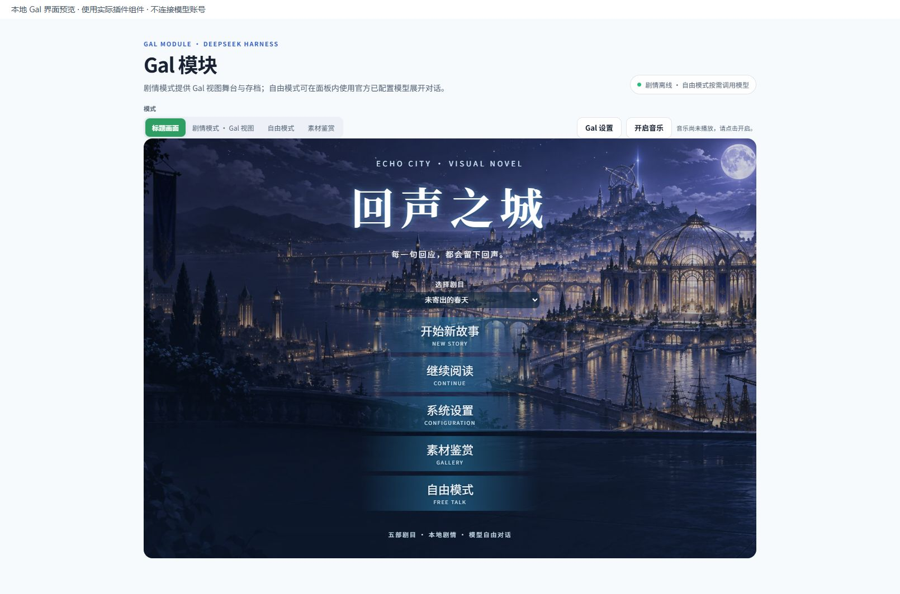
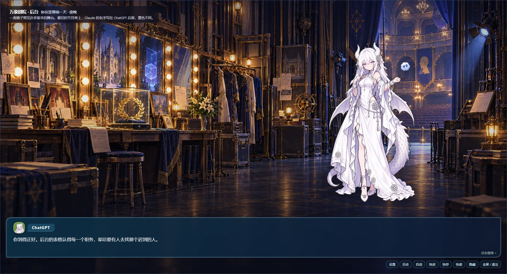
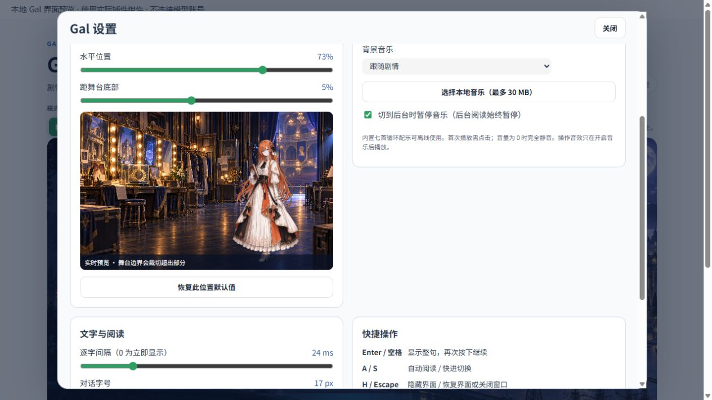

# Model Router Galgame

> **Current delivery:** **0.11.0 is a local candidate, not published to npm or GitHub.** Install `F:\everyAI\all\model-router-galgame\dist\ljwei-stak-model-router-galgame-0.11.0.tgz` through the Desktop plugin manager. It adds Gal portrait settings, audio controls, reading controls, save backups, and an open artwork gallery. Verification results are recorded in the project report; live model sign-in and billing remain account-holder checks.

**A model routing and Galgame plugin for DeepSeek Harness Desktop.** It plans which of your configured models should handle a task, gives simpler work to an affordable capable route, and reserves stronger routes for difficult work. Compound requests become dependent work packages that can be run through supported official vendor tools.

[简体中文说明](README.zh.md) · [Installation guide (Chinese)](INSTALLATION_GUIDE.zh.md) · [Gal settings guide (Chinese)](docs/GAL_SETTINGS.zh.md) · [Previously published v0.10.1](https://github.com/Alice-Marx/model-router-galgame/releases/tag/v0.10.1)

> **Host compatibility:** 0.11.0 retains the **0.2.0-rc.1 / 0.2.0-rc.2** peer ranges introduced by the local 0.10.2 compatibility fix. **Published 0.10.1 only accepts rc.1** and is rejected on rc.2. Neither 0.10.2 nor 0.11.0 currently has a published npm version or GitHub release. The new Gal controls reuse the five existing stories and artwork; this update adds player features rather than a new story or artwork set.


*Workflow diagram. Planning uses the configured Harness model directory and optional user-provided model data. A plan does not itself start vendor tools or spend tokens.*

## What it does

| Area | Available behavior |
| --- | --- |
| **Model Router** | Classifies task type and complexity, splits compound requests into a dependency graph, recommends an exact configured `provider/model` for each work package, and displays quality evidence and estimated cost when available. |
| **Model profiles** | Lets you enter your own 0–100 quality score, USD input/output price per million tokens, specialties, and an optional vendor CLI model name for an exact Harness route. Missing prices remain unknown. |
| **Official tools** | Detects and offers one-click, fixed-source installation for Kimi Code, Claude Code, Codex CLI, MiniMax Code, MiMo Code, Grok Build, and ZCode. The panel shows installation and trusted launch readiness separately. |
| **Execution** | Session tools can consult another configured Harness model, run one supported official CLI, or execute a sequence of dependent work packages with the CLI team runner. |
| **Gal Module** | Five offline stories, portrait size/position settings, seven music loops and session-only local audio, automatic reading and read-only skipping, three manual slots, an independent quick save, JSON backups, and an open artwork gallery. Free mode can chat through a configured Harness model or copy a roleplay opening prompt. |


*Desktop capture from an isolated compatibility profile. A green launch check means the local entry point passed the plugin's checks; it does not prove that the vendor account can authenticate or that a paid task will succeed.*

## Install the right version

| Plugin version | Intended host | Install status |
| --- | --- | --- |
| **0.11.0** | **DeepSeek Harness Desktop 0.2.0-rc.1 / 0.2.0-rc.2** | Current local candidate. Install the local archive; no npm or GitHub publication yet. |
| **0.10.2** | **DeepSeek Harness Desktop 0.2.0-rc.1 / 0.2.0-rc.2** | Historical local compatibility fix, verified in an isolated official rc.2 runtime; not published. |
| **0.10.1** | **DeepSeek Harness Desktop 0.2.0-rc.1 only** | Historical prerelease; the Desktop plugin manager rejects it on rc.2. |
| **0.9.0** | **DeepSeek Harness Desktop 0.2.0-rc.1** | Previously published on npm and GitHub. This older build lacks the new Gal content. |
| **0.8.0** | DSH 0.1.7-rc.2 dependencies | Incompatible with Desktop 0.2.0-rc.1; the Desktop plugin manager rejects it. |
| **0.4.32** | Legacy `@deepseek-ai/dsh-settings` peer range `^0.1.1-rc.1 \|\| ^0.1.2-rc.1 \|\| ^0.1.5-rc.1` | Still carries npm's `latest` tag as of 2026-09-29. Installing without an explicit version can select this older package; this row does not claim every older Desktop build was tested. |

### Install the current 0.11.0 local archive

Open **Plugins → Add plugin** in DeepSeek Harness Desktop and enter:

```text
F:\everyAI\all\model-router-galgame\dist\ljwei-stak-model-router-galgame-0.11.0.tgz
```

The input must match the archive's actual absolute path. You may copy the archive to another drive and enter that path instead. Local installation does not depend on an npm mirror. Install, enable, and restart if prompted. Confirm plugin details show **0.11.0**, the host is **0.2.0-rc.1 or 0.2.0-rc.2**, and the sidebar shows **Model Router** and **Gal Module**. Global `npm install -g` does not register a plugin in your Desktop profile.

### Upgrading an existing local plugin

If no matching plugin is listed under **Installed**, install the candidate directly. If a same-named older copy is present, export current story progress when possible and back up your profile data, then follow the plugin manager's instructions to remove the older instance before adding the candidate. Disabling the old instance may still leave it marked as installed. Preserve the profile and application data. The existing manual save keys remain compatible.

You can also extract the archive and enter its inner `package` directory, which contains `package.json` and `.dsh-plugin`. Where a checksum sidecar is supplied, compare it with `Get-FileHash -Algorithm SHA256 -LiteralPath 'F:\everyAI\all\model-router-galgame\dist\ljwei-stak-model-router-galgame-0.11.0.tgz'`. Do not work around the old rc.1-only peer rejection by modifying `app.asar` or bypassing the version check.

### npm installation after a future publication

After an explicit publication has completed and its registry contents have been verified, the plugin manager can use an exact package version such as `@ljwei-stak/model-router-galgame@0.11.0`. **This is a future example, not an available install source today.** The currently published 0.10.1 archive is available from its [historical release](https://github.com/Alice-Marx/model-router-galgame/releases/tag/v0.10.1), but its peers only support rc.1.

### Previously published 0.9.0: install by package name

1. In DeepSeek Harness Desktop, open **Plugins → Add plugin**.
2. Enter this exact package name, including the version:

   ```text
   @ljwei-stak/model-router-galgame@0.9.0
   ```

3. If the selected mirror cannot reach the package, choose an available **HTTPS** npm source, for example `https://registry.npmjs.org/`.
4. Install and enable the plugin. The sidebar should show **Model Router** and **Gal Module**.

### Previously published 0.9.0: install the release archive

Download [`ljwei-stak-model-router-galgame-0.9.0.tgz`](https://github.com/Alice-Marx/model-router-galgame/releases/download/v0.9.0/ljwei-stak-model-router-galgame-0.9.0.tgz) from the [v0.9.0 GitHub release](https://github.com/Alice-Marx/model-router-galgame/releases/tag/v0.9.0), then enter its absolute path in the Desktop **Add plugin** input (for example, `D:\Downloads\ljwei-stak-model-router-galgame-0.9.0.tgz`). On Windows, you can check the downloaded file:

```powershell
Get-FileHash 'D:\Downloads\ljwei-stak-model-router-galgame-0.9.0.tgz' -Algorithm SHA256
```

The published 0.9.0 archive has SHA-256 `FB06ED5527DE256062BB932EF5A35AF8FF9BEB8B6D2B3F635E2F30D0736A8E4B`. Replace the example path with your download path. The npm and GitHub release archives were downloaded and compared byte for byte during publication.

### Build the local candidate from source

With Node.js 22.19+ and pnpm installed, use the complete local source checkout containing `package.json` version 0.11.0, then run these commands from the repository root. There is no published `v0.11.0` or `v0.10.2` tag to check out:

```powershell
pnpm install --frozen-lockfile
npm run build:client
New-Item -ItemType Directory -Force dist | Out-Null
npm pack --pack-destination dist
```

Install the resulting `.tgz` through the plugin manager. Use the plugin manager for upgrades too; do not modify the Desktop application directory or `app.asar`. See the [installation guide](INSTALLATION_GUIDE.zh.md) for the full Windows checklist, including tool installation outside the C drive.

After enabling the plugin, configure your providers, models, and credentials on Harness's official **Models** page. The router only considers routes present there; its profile editor does not accept API keys.

## Use the Model Router workbench


*Operation schematic, not a Desktop screenshot. The generated result appears **below** the model-profile editor, so scroll down after clicking the button.*

1. Open **Model Router** in the sidebar. The top status shows how many providers and routes the official **Model directory** returned. If it is empty, configure a provider and model on Harness's official **Models** page, then click **Refresh** in the workbench's directory card. A route appearing in the directory does **not** prove that its credentials or network connection work.
2. In **Task planning → Task description**, write what you want done and list distinct actions on separate lines for a compound request. Choose **Single task** for one direct recommendation or **Team allocation** for dependent work packages. Team mode decomposes requests that the router classifies as complex; selecting the mode alone does not start a team.
3. The **Estimated budget for this run (USD)** field may show `10`. That is **$10 for planning**, based on your supplied prices and estimated tokens. Set it to `0` to remove the estimate constraint. Neither value caps a provider bill or authorizes a model call.
4. Click **Generate route recommendation**. Planning runs locally. Scroll down **past Model pricing and capabilities** to **Route recommendation**. Read the recommended `provider/model`, complexity band, estimated cost or “price needs configuration,” and the **execution channel** badge. In team mode, check each package's objective, difficulty, route, dependencies, verification checklist, and warnings. `Official CLI` means a trusted local launch entry is ready; `Model directory API` means the plan routes through Harness's configured model API.
5. To improve the recommendation, save each exact `provider/model` route's quality score and input/output prices in **USD per million tokens** in the **Model pricing and capabilities** editor, then click **Generate route recommendation** again. Saving a profile invalidates the previous result; a missing price remains unknown. Review the **Official tools** cards below the result for probe, install/repair, and launch-readiness status. ZCode opens its own installer and requires you to complete its directory choice.
6. To actually ask or run a model, open an **official Harness session** and request `model_router_consult` for a live second opinion, `model_router_tool_run` for one ready vendor CLI, or `model_router_team_execute` for dependent CLI work packages. You can also use `/router` to request a plan and `/tools` to inspect tools in a session. An editable CLI task requires approval and a clean Git repository; check the vendor run record for the actual model and charge.

For example, enter: “**Plan a complex, three-minute science-fiction short film.** Extract the premise and constraints; design a beat sheet and shot list; review visual continuity and production risks; synthesize a handoff checklist.” Choose **Team allocation**, generate the plan, and inspect which configured routes it assigns to the writing and review packages. This plugin produces a *plan* and can delegate supported CLI tasks; it does **not** render a film or control nine creative applications.

The [full Chinese workbench guide](docs/WORKBENCH_USER_GUIDE.zh.md) walks through the controls, result location, model-profile setup, and session handoff.

## How the routing decision is derived

The router is a **deterministic, local heuristic**. It exposes its inputs and decision record. Its quality scores are user estimates, available benchmark data, or catalog hints—not measured success probabilities for your particular task. It does not guarantee a globally optimal assignment.

### 1. Turn the request into a complexity band

The task text contributes length, explicit requirements, domain markers, and code/reasoning/vision signals. Each normalized feature is clipped to `[0, 1]`:

```text
L = clip(character_count / 2200)
R = clip(numbered_or_bulleted_requirements / 8)
D = clip(domain_marker_count / 5)
C = clip(0.10 + 0.30L + 0.18R + 0.28D
         + 0.22·I_code + 0.20·I_reasoning + 0.12·I_vision)
```

The initial bands are `simple` for `C < 0.34`, `balanced` for `0.34 ≤ C < 0.66`, and `complex` above that. Explicit simple requests such as a short translation, and high-stakes action requests such as designing a security-sensitive architecture, have rule-based overrides. These are text signals, not a model's hidden chain of thought.

### 2. Split compound work into a directed acyclic graph

A complex request begins with **analysis** and ends with **synthesis**. Action-like lines, bullets, clauses, or sentences can become up to six explicit execution packages. A request for testing or verification adds a verification package. The `dependsOn` edges put analysis before execution, verification after the relevant execution packages, and synthesis after all required results. Sequential wording such as “then” adds an edge between execution packages.

```text
analysis ──┬── keyword extraction ────────────┐
           ├── architecture design ──┐        │
           └── security review ──────┴── verification ── synthesis
```

Each package has its own task type, difficulty, quality floor, recommended route, dependencies, and verification checklist. A simple request normally remains one execution package.

### 3. Filter and score only routes you configured

The candidate set comes from the official Harness model directory. A profile overlays an **exact** `provider/model` pair; typing a model name into the editor does not create a usable route. Vision packages require a route that declares image support or has not declared input modalities; if no candidate can take the image package, the plan reports it as unassignable.

The base quality floors are **0.75 / 0.78 / 0.82** for simple / balanced / complex work. For a complex package, the floor becomes `clip(0.82 + 0.12·max(0, criticality − 0.65))`; synthesis has a minimum of **0.84** in a complex plan. Candidates below a floor are excluded if feasible candidates exist. If none meet it, the planner can relax the floor and explicitly marks the constraint as relaxed.

For a feasible candidate `m` and package `i`, the ranking combines normalized quality, price, latency, specialty match, reasoning-effort fit, and risk:

```text
U(i,m) = wq·quality + wc·cost_score + wl·(1 − latency)
       + ws·specialty + we·reasoning_fit − wr·risk
       − criticality·max(0, quality_floor − quality)
       − 0.015·dependency_route_switches
```

The task band changes the weights. For example, simple work gives cost **0.45** and quality **0.28**, while complex work gives quality **0.48** and cost **0.14**. Synthesis shifts further toward quality and reasoning fit. With cache-read/write ratios `r` and `w`, effective input price is `p_eff=(1−r−w)·p_in+r·p_read+w·p_write`. Let `M=max(1,max_candidates(p_eff+p_out))` and let `m_out` be the reasoning effort's output multiplier. Then `cost_score=clip((1−(p_eff+p_out)/(2M))/sqrt(m_out))`. This normalized score is distinct from the USD estimate; a missing price scores zero internally but remains unknown in the public estimate.

| Package difficulty | Quality | Cost | Latency | Specialty | Reasoning | Risk penalty |
| --- | ---: | ---: | ---: | ---: | ---: | ---: |
| Simple | 0.28 | 0.45 | 0.14 | 0.04 | 0.07 | 0.02 |
| Balanced | 0.40 | 0.26 | 0.10 | 0.09 | 0.10 | 0.05 |
| Complex | 0.48 | 0.14 | 0.06 | 0.14 | 0.11 | 0.07 |
| Synthesis | 0.58 | 0.08 | 0.04 | 0.08 | 0.16 | 0.06 |

The planner removes candidates dominated on the compared quality, estimated price, latency, specialty, reasoning fit, and risk dimensions. It retains key cheapest/highest-score/highest-quality options, searches up to **12 candidates per package**, and keeps up to **256 assignment states** at each step. A user-provided estimate budget restricts the search when feasible; otherwise the plan reports an over-budget or infeasible result. This bounded beam search is why the output is repeatable and inspectable, but not a proof of a global optimum.


*Illustrative candidate plot, not actual model benchmark or price data. A candidate must first clear the package's quality floor when possible; the remaining routes are compared on several dimensions before bounded assignment search.*

### 4. Estimate cost and compare a baseline

User-entered prices are in **USD per million tokens**. For each package, the router estimates input tokens from text length and applies package and reasoning-effort multipliers; it also estimates output and optional cache-read/write tokens. With effective prices, the calculation is:

```text
estimated_package_USD = (
    uncached_input_tokens × input_price
  + cache_read_tokens × cache_read_price
  + cache_write_tokens × cache_write_price
  + output_tokens × output_price
) / 1,000,000

estimated_saving = (all_strong_baseline − routed_estimate)
                 / all_strong_baseline
```

“All strong” means selecting the highest estimated-quality route for each package. If any selected package lacks a trustworthy USD price, the total and saving remain **unknown**, rather than treating the route as free. Savings are also withheld when quality evidence is incomplete. These token counts are planning assumptions: the estimate is neither a provider quote nor a hard billing cap.

### Worked example: cheap extraction, strong design

Suppose the *already configured* model directory contains two demo routes with these **illustrative, user-entered values** (not vendor prices):

| Demo route | Quality | Input USD / 1M | Output USD / 1M | Specialty |
| --- | ---: | ---: | ---: | --- |
| `cheap-provider/Flash Custom` | 0.79 | $0.10 | $0.20 | Summarization |
| `strong-provider/Reasoning Custom` | 0.97 | $5.00 | $25.00 | Reasoning, code |

For the exact example input below, the complexity score is about **0.705** and the plan has six packages: analysis, three explicit execution packages, verification, and synthesis.

```text
请处理项目。
- 请提取关键词
- 请设计复杂系统架构
- 最后验证架构安全性
```

The extraction package is simple: **0.79 ≥ 0.75**, so Flash qualifies and its cost weight is high. The architecture and security work need the stronger Reasoning route. Their dependency edges keep verification and synthesis after the work they inspect.

With zero cache usage and no per-route reasoning-effort options, the estimator uses these package token assumptions (the displayed costs are rounded to six decimals):

| Work package | Route | Estimated input / output tokens | Estimated USD |
| --- | --- | ---: | ---: |
| Analysis | Reasoning | 80 / 495 | $0.012775 |
| Extract keywords | Flash | 96 / 900 | $0.000190 |
| Design architecture | Reasoning | 96 / 1,305 | $0.033105 |
| Verify security requirement | Reasoning | 96 / 1,305 | $0.033105 |
| Independent verification | Reasoning | 92 / 630 | $0.016210 |
| Synthesis | Reasoning | 132 / 1,170 | $0.029910 |

The sum uses unrounded package estimates: **$0.125295**. Assigning all six packages to Reasoning instead estimates **$0.148085**:

```text
($0.148085 − $0.125295) / $0.148085 × 100 = 15.39% estimated saving
```

The numbers demonstrate the calculation, not a promised saving. Different model profiles, prompts, cache behavior, CLI defaults, or actual token usage will change the result. The implementation and a corresponding routing case are in [router.mjs](.dsh-plugin/shared/router.mjs) and [router.test.mjs](tests/router.test.mjs).

## Configure your model routes

Open **Model Router → Model pricing and capabilities**. Choose a route that actually appears on the official Models page, then supply information you have verified or are willing to use as a planning assumption. The stored structure is a JSON array; the visual editor saves it for you. A minimal example is:

```json
[
  {
    "provider": "your-exact-provider-id",
    "model": "your-exact-model-id",
    "quality": 80,
    "pricing": { "input": 0.5, "output": 2.0, "currency": "USD" },
    "specialties": ["code", "summarization"],
    "cliModel": "name-configured-in-that-vendor-cli"
  }
]
```

`quality` is a personal 0–100 comparison score. `pricing.input` and `.output` are nonnegative USD rates per million tokens; optional `cacheRead` and `cacheWrite` rates are supported. The optional `cliModel` must match the name accepted by that vendor's own CLI, which may differ from the Harness directory ID. MiniMax and MiMo expect `provider/model` for that field. ZCode 3.14.3 cannot switch models per call, so it does not accept `cliModel`.

## Official tools and actual execution

The seven tool cards use a fixed registry. Six install version-pinned official npm packages; ZCode opens a pinned, hash-checked, signed Windows desktop installer where you select the destination directory. On Windows, if MiniMax's npm native dependency cannot install, the plugin checks a pinned official installer script and installs the pinned release under the configured npm global prefix. A changed script fails closed until reviewed in a plugin update. Tool cards support detection, installation or repair, cancellation, and logs; they never accept arbitrary package names or shell commands.

From a Harness session, these plugin tools are available:

| Tool | Purpose |
| --- | --- |
| `model_router_routes` / `model_router_plan` | Show configured routes or generate a local plan. `/router` is the session command for a plan. |
| `model_router_consult` | Ask another configured Harness model for a live second opinion. This can incur provider charges. |
| `model_router_tools` / `model_router_tool_install` | Probe or install a fixed official tool. `/tools` exposes the human command. |
| `model_router_tool_run` | Run one ready vendor CLI in the approved session workspace. |
| `model_router_team_execute` | Run dependent work packages through ready vendor CLIs in order; stop on failure or a reported model mismatch. |

Claude Code, Codex, MiMo Code, and Grok Build support read-only and approved editable runs. Kimi Code, MiniMax Code, and ZCode headless modes handle permissions automatically, so the plugin only permits approved editable runs for them in an isolated Git worktree. Editable execution requires a clean Git repository. A successful run applies source changes only after the original checkout remains clean; ignored outputs remain for manual review. The official Harness process sandbox wraps launches, while its Windows ACL backend reports only partial file-effect enforcement.

The planned Harness model ID is not necessarily the vendor CLI's model name. A saved `cliModel`, or temporary `cliModelsJson` keyed by tool or work-package ID, can provide a known vendor CLI name. A package-specific temporary mapping takes priority over a tool mapping, then the saved profile. ZCode uses its configured default model. Most vendor CLIs do not provide a verifiable actual model ID in their results, so inspect vendor run records to confirm which model and price applied. The plugin's sequential CLI team runner is separate from Harness's built-in Agent Teams lifecycle.

## Gal Module


*Story artwork from the plugin's Gal assets; it is not a capture of the running interface.*

The **Story** tab runs locally: backgrounds, portraits, dialogue, choices, history, endings, autosave, manual slots, quick saves and JSON backups. No model account is needed. Version 0.11.0 retains five episodes:

The module opens on a **title menu**. Select an episode and choose **Start new story** or **Continue**; settings, the gallery and Free mode are also available there. The in-stage controls remain available in fullscreen.

| Episode in the selector | Scope | Ending distinction |
| --- | --- | --- |
| **千桥协议** (Thousand Bridges) | Eight main chapters and character side stories. | Six institutional endings. |
| **旧城迁移篇** (Old City Migration) | The earlier complete migration story. | Its own existing branches. |
| **雪灯来信** (Letter by Snowlight) | A **standalone five-chapter adaptation**, nine choices. | Two short-story endings, “各自点灯” and “如常”; neither is the full saga's TRUE END. |
| **未寄出的春天** (The Unsent Spring) | An **independent twelve-chapter sequel** with nine optional character routes. | Five endings. The conditional “letters” ending requires two preserved originals, asking each person for consent, distributed relay, a shared anchor, and at least two completed side routes. |
| **回声之城·正篇** (Echo City: Main Saga) | Prologue, eight common chapters, six character routes, hidden *Shadow and Self* with the naming night, and a TRUE END. | **Only the ChatGPT/princess route has separate true and dark endings**; completing all six routes and the hidden route unlocks the ensemble TRUE END. |

Open **Gal Module → Story mode**, choose an episode, advance the dialogue and select choices. **History** revisits prior lines. **Save 1–3 / Load 1–3** keeps manual checkpoints; Thousand Bridges and Old City Migration retain their historical shared slots, while the three newer episodes have independent slots. A per-episode **Quick save** does not consume those slots. Export a JSON backup before upgrades or moving to another profile; imports accept the same episode, enforce a 2 MB UTF-8 limit, and confirm before replacing current progress.

For the short story, Spring, and older episodes, directly entering a chapter starts it with fresh state rather than inheriting earlier choices; play from the beginning to see consequences carry through. The **Main Saga** preserves flags and 14 character-affinity values across sequential chapter changes. Its hidden route requires the DeepSeek/snow route's true ending, a complete transcription of the chapter-four note, and two observations of the steward's daily life. All six character routes and the hidden route are required for the TRUE END. The naming night lets you name the steward; the default is 衔雪.

### Portraits, music and reading controls

**Full-body original artwork** is the default stage source, using all 28 existing character originals, including the orange-haired Claude supplied by the user. The stage reserves space above dialogue and choices to keep the complete body visible. **Expression close-ups** remain an alternative. Full-body moods use the same original image; dialogue avatars can still change expressions. This update does not add newly painted full-body expression variants.

Open **Gal Settings** from the page header or Story toolbar. Adjust **Main character default** and **Companion default** separately, or select a named character to create a size/position override. Scale is 40–180%, horizontal position is 0–100%, and bottom offset is −30–50%. The preview updates immediately and settings are saved to the current profile. Clear a character override to inherit the defaults; resetting all Gal settings preserves story saves and read-node records.

Seven built-in music loops play offline after you click **Enable music**. Music and UI effects have separate 0–100% volume controls; zero volume is silent, and **Mute all** covers both. You may select a recognized local audio file up to **30 MB**; it stays on your machine and is available only for the current plugin session, so select it again after reopening. This player has optional UI cues, not voiced character dialogue.

Set text interval (0–120 ms; 0 reveals immediately), font size (12–32 px), auto-reading delay (300–10000 ms), and dialogue opacity (20–100%). **Auto read** waits until each line finishes. **Read-text skip** stops at unread content unless you explicitly enable skipping unread text. Both stop at choices, naming inputs and endings; neither chooses branches. Reading pauses while settings, history or confirmation views are open and while the page is hidden. The music background-pause option separately controls music.

Click the Story stage's blank area to focus it before using **Enter/Space** to reveal or continue, **A/S** for auto/skip, **H/Escape** to hide/restore the interface, **F** for stage fullscreen, **Q/L** for quick save/load, and **←** for the previous line. Text inputs and controls keep their own keys. Previous-line rollback retains at most **30 steps in this reading session** and is cleared by reopening, switching episodes/chapters, or loading a save.

The **Artwork gallery** exposes the existing portraits and scene images from the start, with expression fallbacks and possible spoilers. It is an open asset viewer, not a progression-unlocked CG collection. See the [detailed Chinese player guide](docs/GAL_SETTINGS.zh.md) for every control and recovery step. JSON backups contain current story progress, not the entire profile, settings, music file or all manual slots.

Spring content revision 1 saves remain readable in revision 2; loading them does not invent flags for newly added choices. To experience the new **preserve two originals** and **ask each person** choices, manually save old progress in a slot and restart Spring from its opening. Story saves are local to the current Desktop profile and are not cloud backups. The stories use fictional personifications; their dialogue does not establish real product capabilities or prices. See the [Chinese five-story play guide](docs/ECHO_CITY_STORY.zh.md) for chapter and ending details.

The **Free** tab uses an officially configured model route for in-panel chat, can stop a pending response, or copies the opening prompt into a Harness session. Portrait and text settings are shared with Story mode. Free-mode replies are real model calls and may incur charges. The plugin does not store provider credentials; real sign-in, permissions and billing remain user acceptance checks.

The existing 0.10.1 artwork collection provides **28 original PNG portraits** for base-image display and Free-mode character selection. **27 story characters × six generated expressions = 162** expression sprites, plus six Echo City backgrounds from that earlier update. JEV has an original base portrait and is selectable in Free mode, but has no story appearance or expression set. Two-person scenes use `cast` and `stageCharacters`. This player update reuses those assets; the [portrait provenance guide](docs/GAL_ART_SOURCES.zh.md) separates originals from generated variants.



*The actual 0.11.0 component in a local browser preview: episode selection, new story and continue.*



*The 0.11.0 archive loaded by the installed official rc.2 runtime in a separate test profile. Full-body art remains above the translucent dialogue box; in-stage controls work in fullscreen.*



*Claude's complete original portrait with live layout controls, music and reading settings. Title and settings images are local component previews; the stage is from the isolated official rc.2 runtime. The user's current Desktop profile still needs acceptance.*

## Verification status and further reading

The **0.11.0** candidate passes **153 main tests and 75 additional story/game tests, 228 in total**. Component checks covered persistent settings, auto-reading branch stops, quick saves and guarded imports. This archive also loaded in a separate profile of the installed official rc.2 runtime, confirming both sidebar entries, the title menu, original full-body art and fullscreen history. Current-profile installation, live sign-in, model identity and billing remain acceptance checks.

The [Gal player project report](PROJECT-TASK-REPORT-2026-10-01-GAL-PLAYER.md) records file roles, checks, acceptance steps and remaining work. See the [rc.2 compatibility report](PROJECT-TASK-REPORT-2026-10-01-RC2-COMPAT.md) for the previous host validation and the [migration notes](MIGRATION.md) for older integrations.
