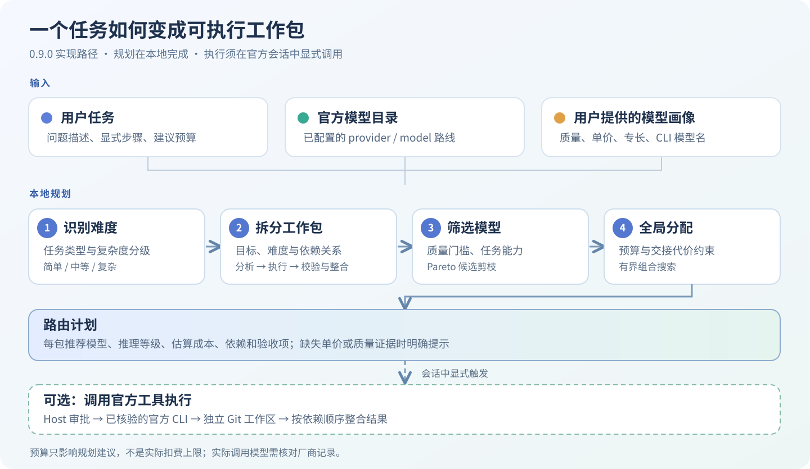
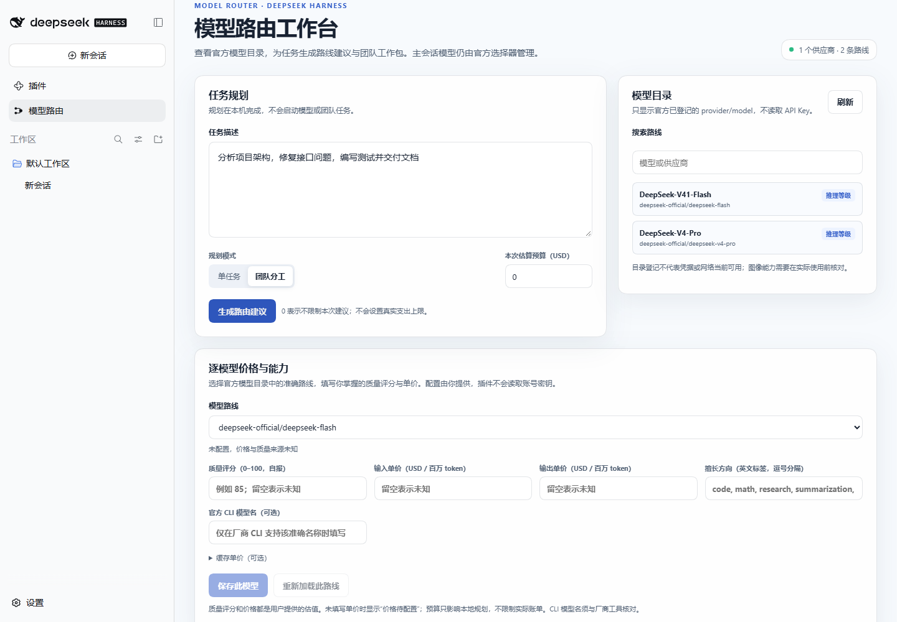
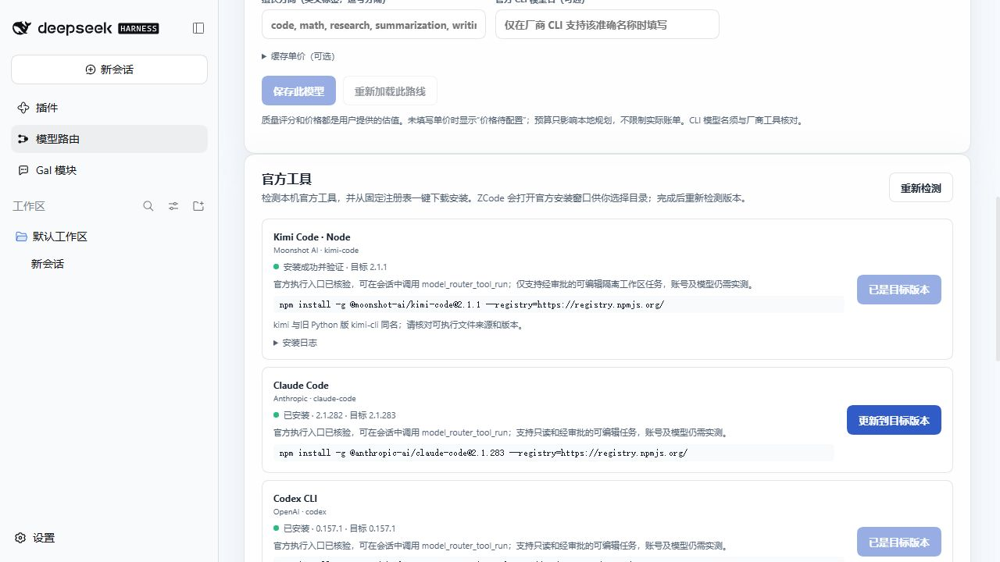
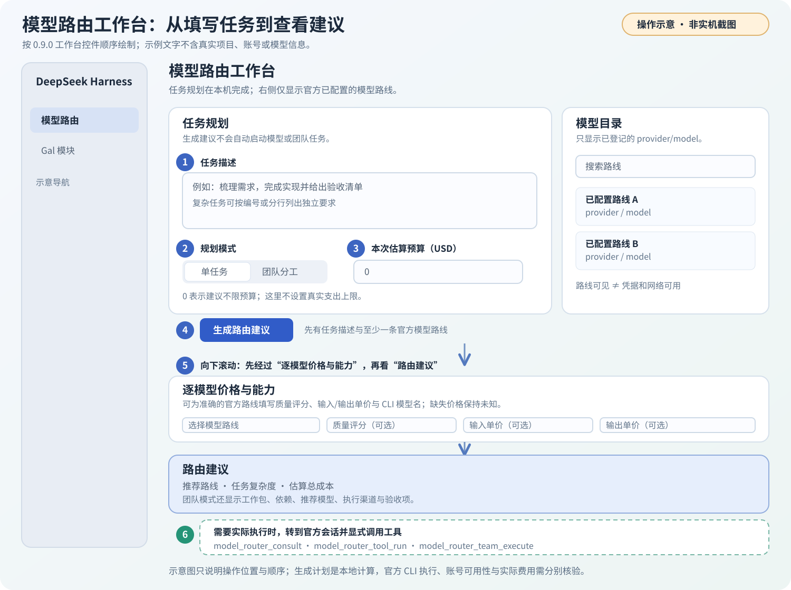
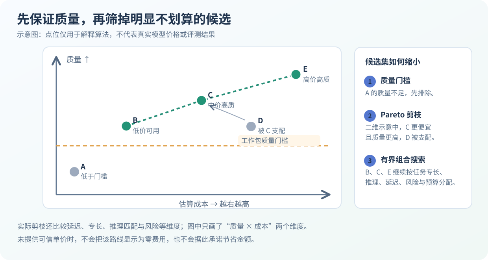

# Model Router · DeepSeek Harness 模型路由插件

**0.13.0 新增开箱体检、成本控制、订阅优先计费与执行记录；自 0.12.0 起模型路由与 GAL 是两个独立插件。** 路由器分析问题、判断难度，在用户已配置的模型中选择合适路线：简单工作更重视费用，困难工作更重视质量，复合任务拆成有依赖的工作包，再由支持的官方模型工具执行。

**自 0.13.0 起 npm 包名改为 `@ljwei-stak/dsh-model-router`**，旧名 `@ljwei-stak/model-router-galgame` 最后版本为 0.13.0（与新包 0.13.0 内容相同），之后不再更新，升级时需卸载旧插件再添加新包（见[从旧包名升级](#从旧包名-ljwei-stakmodel-router-galgame-升级)）；**自 0.12.0 起只提供“模型路由”入口**。要玩剧情、调整立绘、听音乐或自由对话，请另装 [DeepSeek Harness GAL](https://github.com/Alice-Marx/deepseek-harness-galgame)。两个插件互不依赖，可单独安装，也可同时安装。

[English](README.md) · [安装与验证指南](INSTALLATION_GUIDE.zh.md) · [迁移说明](MIGRATION.md) · [独立 GAL 仓库](https://github.com/Alice-Marx/deepseek-harness-galgame)

> **宿主版本：**模型路由 0.13.3 与 GAL 0.1.0 均声明支持 DeepSeek Harness Desktop **0.2.0-rc.1 和 0.2.0-rc.2**。宿主仍是预发布版本，本轮发布使用 npm `next` 标签；推荐精确版本安装，不要依赖裸包名或不断变化的标签。



*图：路线来自 Harness 官方模型目录，质量与价格可由用户补充。生成计划在本机完成，不会启动 CLI 或消耗模型 token。*



*本轮隔离 rc.2 profile 实拍：仅安装路由插件，左侧没有 GAL；显示内置路线，没有调用真实模型账号。*

## 目录

- [安装与版本选择](#安装与版本选择)
- [开始使用](#开始使用)
- [工作台页面怎么用](#工作台页面怎么用)
- [体检、成本与质量回路](#体检成本与质量回路)
- [订阅优先：额度用尽才切换 API Key](#订阅优先额度用尽才切换-api-key)
- [路由算法：从输入到分配](#路由算法从输入到分配)
- [官方工具与执行边界](#官方工具与执行边界)
- [可选安装 GAL](#可选安装-gal)
- [验证与开发](#验证与开发)

## 安装与版本选择

在 **DeepSeek Harness Desktop → 插件 → 添加插件** 中，按需求填写一个完整包名：

| 安装内容 | 输入框填写 | GitHub 仓库 |
| --- | --- | --- |
| 模型路由、模型档案与官方工具 | `@ljwei-stak/dsh-model-router@0.13.3` | [Model Router](https://github.com/Alice-Marx/dsh-model-router) |
| GAL 剧情、自由模式与播放器 | `@ljwei-stak/dsh-galgame@0.1.0` | [DeepSeek Harness GAL](https://github.com/Alice-Marx/deepseek-harness-galgame) |

1. npm 安装源选择官方 **HTTPS** 地址 `https://registry.npmjs.org/`；国内镜像尚未同步时可改用此源或版本化 GitHub 安装包。
2. 核对安装预览版本与宿主版本，安装并启用；有重启提示时重启。
3. 路由详情应为 **0.13.3**，侧边栏显示 **模型路由**；独立 GAL 详情应为 **0.1.0**，另显示 **Gal 模块**。

普通使用不需要 `npm install -g`：全局 npm 安装不会注册到当前 Harness profile。路由与 GAL 都可以不安装另一插件而运行。


### 从旧包名 @ljwei-stak/model-router-galgame 升级

0.13.0 起包名改为 `@ljwei-stak/dsh-model-router`。旧包名的最后版本同样是 0.13.0，内容相同，之后的更新只发布到新包名。插件管理器无法原地更新旧条目：

1. 在插件管理器卸载 `@ljwei-stak/model-router-galgame`（保留 profile 与应用数据）。
2. 添加 `@ljwei-stak/dsh-model-router@0.13.3`，按提示重启。
3. 不要两个同时安装：二者使用相同的 profile 条目 id `model-router-galgame` 和相同的 `model_router_*` 工具名。条目 id 未变，所以 profile 中保存的路由设置以及 `~/.dsh/model-router/state.json` 里的执行记录会保留。

### 从合并版 0.11.x 升级

1. **先备份**：旧版 GAL 中对需要保留的剧情进度使用“导出存档”，并备份 Harness profile。JSON 仅包含当前剧情状态，不包含全部手动槽、设置、已读记录与本地音乐。
2. 在**同一个 profile**安装 `@ljwei-stak/dsh-galgame@0.1.0`。
3. 在插件管理器卸载原 `@ljwei-stak/model-router-galgame`，再添加 `@ljwei-stak/dsh-model-router@0.13.3`（见上文“从旧包名升级”）。完成两项安装后再游玩；旧合并插件的 GAL 入口随路由升级移除，只留下新 GAL 插件的入口。
4. 打开独立 GAL 检查进度。它保留原 localStorage 存档键；更换 profile 或没有读到旧进度时，先选择对应剧目，再导入备份 JSON。

独立 GAL 核心只内置**《回声之城·正篇》**和**《旧城迁移篇：未写完的约定》**。此前分出的其他篇目保留在源代码归档，不随这两个核心插件发布。完整迁移步骤见[迁移说明](MIGRATION.md)。

### 使用 GitHub 安装包

从[路由 v0.13.0 Release](https://github.com/Alice-Marx/dsh-model-router/releases/tag/v0.13.3)或[GAL v0.1.0 Release](https://github.com/Alice-Marx/deepseek-harness-galgame/releases/tag/v0.1.0)下载 `.tgz`，在添加插件输入框填写文件绝对路径，例如：

```text
D:\Plugins\ljwei-stak-dsh-model-router-0.13.3.tgz
```

如附有 `.sha256` 校验文件，使用以下命令计算摘要并比较：

```powershell
Get-FileHash -Algorithm SHA256 -LiteralPath 'D:\Plugins\ljwei-stak-dsh-model-router-0.13.3.tgz'
```

也可解压并填写内层含 `package.json` 和 `.dsh-plugin` 的 `package` 目录。安装包可放到自选磁盘；运行数据位置由宿主 profile 决定。不要改 `app.asar` 或绕过依赖检查。

### 历史版本

| 版本 | 声明的宿主 | 功能范围 |
| --- | --- | --- |
| **模型路由 0.13.3** | **0.2.0-rc.1 / rc.2** | 修复 Windows 版 Harness Desktop 中官方 CLI 执行无输出（沙箱启动器环境；Codex 改用自带只读沙箱）。更新后请完全重启 Harness。推荐精确版本，也可用 `@next` / `@latest`。 |
| [模型路由 0.13.2](https://github.com/Alice-Marx/dsh-model-router/releases/tag/v0.13.2) | 0.2.0-rc.1 / rc.2 | Codex 支持非 Git 工作区；Windows Desktop 中经沙箱的 CLI 执行仍无输出。 |
| [模型路由 0.13.1](https://github.com/Alice-Marx/dsh-model-router/releases/tag/v0.13.1) | 0.2.0-rc.1 / rc.2 | 修复 `cannot get property "credentials" without inject`；Windows 上 Codex 拒绝非 Git 工作区。 |
| [模型路由 0.13.0](https://github.com/Alice-Marx/dsh-model-router/releases/tag/v0.13.0) | 0.2.0-rc.1 / rc.2 | 体检、成本控制、订阅优先、执行记录；在 Harness 中执行会失败（0.13.1 已修复）。 |
| **GAL 0.1.0** | **0.2.0-rc.1 / rc.2** | 独立 GAL 首版，两部核心剧目。推荐精确版本。 |
| [模型路由 0.12.0](https://github.com/Alice-Marx/dsh-model-router/releases/tag/v0.12.0) | 0.2.0-rc.1 / rc.2 | 首个独立路由版本（GAL 拆出）。 |
| [合并版 0.11.1](https://github.com/Alice-Marx/model-router-galgame/releases/tag/v0.11.1) | 0.2.0-rc.1 / rc.2 | 历史路由与 GAL 合并包；修正 0.11.0 发布说明。 |
| [合并版 0.11.0](https://github.com/Alice-Marx/model-router-galgame/releases/tag/v0.11.0) | 0.2.0-rc.1 / rc.2 | 历史播放器更新。 |
| 0.10.2 | 0.2.0-rc.1 / rc.2 | 未发布的本地兼容修复。 |
| [0.10.1](https://github.com/Alice-Marx/model-router-galgame/releases/tag/v0.10.1) | 0.2.0-rc.1 | 历史发布版；rc.2 会拒绝其 peer 范围。 |
| [0.9.0](https://github.com/Alice-Marx/model-router-galgame/releases/tag/v0.9.0) | 0.2.0-rc.1 | 历史官方桌面适配版。 |
| 0.8.0 | 0.1.7-rc.2 依赖 | 与当前 0.2.0-rc.1 / rc.2 不兼容。 |
| 0.4.32 | 旧 DSH settings 依赖范围 | 历史发布记录，不用于当前宿主。 |

不要根据旧包名中的 `galgame` 判断功能范围；以版本和安装预览为准。旧版本与历史 Release 保留，不覆盖、不撤包。

## 开始使用

1. 在宿主的**模型**页配置要用的供应商、模型和凭据。插件只从官方目录读取准确的 `provider/model` 路线，不替用户创建模型账号，也不另存 API Key。
2. 打开**模型路由 → 逐模型价格与能力**。为准备比较的每条路线填写自己认可的质量评分（0–100）、输入/输出单价（USD / 百万 token）、擅长方向；有缓存价格时可另外填写。未知项可以留空，界面会说明估价缺失。
3. 输入任务，先查看单任务、团队计划，或在**指定模型**里直接选一条已配置路线。结果会给出复杂度、工作包目标与依赖、质量门槛、推荐路线、预计费用及 `official-cli` / `harness-llm` 渠道。规划本身**不会调用付费模型**。
4. 在**逐模型价格与能力**里可以为每条路线选择执行方式：`auto` / `official` 优先该厂商官方工具，缺失或失败时回退模型目录 API；`api` 始终走模型目录。不填写时按 `auto`。
5. 在**官方工具**卡片上检测、一键下载安装或修复执行入口。工具就绪只说明安装与可信入口通过核验；首次登录、模型权限和真实费用仍要在对应厂商账号中验证。
6. 在官方会话里使用 `model_router_execute` 按计划或指定模型执行并汇总结果。`model_router_consult` 仍是一次模型目录咨询；`model_router_tool_run` 跑一个已核验的官方 CLI；`model_router_team_execute` 按依赖顺序执行可编辑工作包。可编辑任务需要干净的测试 Git 仓库，并经过宿主的工具审批。 体检、重跑和评价另有 `model_router_health`、`model_router_rerun_step`、`model_router_rate`，见下文。



*图：历史 0.9.0 在官方 Desktop 0.2.0-rc.1 隔离 profile 的实拍。截图里的“Gal 模块”来自当时的合并插件，路由 0.12.0 已移除该入口；账号与安装状态仅属于验证环境。*

## 工作台页面怎么用



*图为不含个人任务内容的操作示意，不是桌面实拍。完整的逐项教程与排障见[工作台使用指南](docs/WORKBENCH_USER_GUIDE.zh.md)。*

1. **先看右侧“模型目录”**：顶部“供应商数 · 路线数”表示 Harness 已登记的 `provider/model`；搜索框只过滤显示，“刷新”重新读取目录。卡片上的“推理等级”不是价格、质量分或登录状态。若列表为空，先去 Harness 官方“模型”页添加供应商与模型。
2. **要比较费用，先向下配置档案**：在“逐模型价格与能力”里选择准备使用的准确路线，填写自报质量评分（0–100）和核对过的输入/输出价格（均为 USD / 百万 token），按**保存此模型**；每条待比较路线分别保存。擅长标签和厂商 CLI 模型名可选。没有价格就留空，不要把未知写成零。
3. **写“任务描述”**：可以粘贴长提案，但最好把要交付的步骤写成编号条目，并写清验收标准。“单任务”只给单项路线建议；“团队分工”会把可执行需求拆成有依赖的工作包，最多六个显式执行包。“指定模型”不比较其他路线，整项任务都交给下拉框里选中的那一条。
4. **设置预算并生成**：“本次估算预算（USD）”中的 `10` 只是本地估价目标，`0` 表示规划不设预算；两者都**不会限制真实账号扣费**。点**生成路由建议**后，继续向下滚过“逐模型价格与能力”，找到新增的**路由建议**卡片。按钮不会启动模型。
5. **读结果**：先核对推荐 `provider/model`、复杂度、估算总成本、执行渠道与警告；团队模式再逐包核对目标、难度、依赖、建议模型、估价和验收项。`官方 CLI` 说明本机相应入口可托管；`模型目录 API` 说明可通过 Harness 模型目录调用，但不等于这个包能由插件的 CLI 团队执行器运行。修改任务、预算或档案后重新生成。
6. **只读任务可以直接在工作台执行**：路由建议下方的“**在工作台执行**”卡片沿用上面的任务描述和规划模式（单任务 / 团队分工 / 指定模型），可另选路由方案，并填写工作区绝对路径（留空则沿用上次运行的工作区，路径必须存在）。点**预览执行计划**后，宿主按 `model_router_execute` 的同一套逻辑生成计划（含超预算自动降级），显示预估费用、预算检查，以及**所有需要确认的原因**（超出预算、不经沙箱启动 CLI）合并在一处。按**全部确认并执行**之前不会调用任何模型；宿主执行前会再核对一次原因，期间有变化（例如预算或登录状态）会拒绝并要求重新确认。结果写入下方执行记录。
7. **可编辑任务另开官方会话**：在左侧点**新会话**并选好工作区。要按工作台结果执行，请求 `model_router_execute`；若只要某一个模型，同时给出该路线的 `provider` 和 `model`。`model_router_consult` 只做模型目录咨询。`model_router_tool_run` 与 `model_router_team_execute` 仍负责已核验 CLI 的可编辑任务。团队执行会按照**当前已就绪且支持所选模式的官方 CLI**重新规划，可能与页面上刚才的静态建议不同；它不会直接读取那张结果卡作为执行清单。

例如，要先给一个三分钟科幻短片做**前期规划**，可以在任务描述中输入：

```text
目标：先交付 3 分钟科幻短片的前期制作方案；不要声称已生成成片。
1. 压缩故事结构，交付约 12 个镜头的分镜文字表和时长。
2. 列出角色、场景、声音、字幕资产与命名规则。
3. 设计素材清单、构建脚本和验收步骤，标明所需软件。
4. 检查总时长、版权、字幕和输出格式，列出待确认事项。
验收：每项写明输入、输出文件名与检查方法。
```

先选**团队分工**、预算填 `0`、点**生成路由建议**并向下看结果；补齐价格后再用 `10` 等估价目标比较方案。如果只想在会话里再得到一次计划，可发送“请调用 `model_router_plan`，按 `team` 模式规划以下任务，`budgetUsd=10`，先不要执行”。若确认要调用已安装 CLI，可在**测试仓库**中请求“请调用 `model_router_team_execute`，对同一任务先以 `read-only` 模式执行可完成的文字/代码检查，并报告每包的实际状态”。想让 CLI 写文件时改为 `workspace-write`，需要干净 Git 仓库及宿主审批。真实执行可能计费。

当前插件能规划短片任务，并通过已适配的官方**模型编程 CLI**处理它们有能力完成的文本或代码工作。**“生成路由建议”不会操作 Blender、ComfyUI、剪辑软件或导出视频。** 要交付成片，还需为相应创作软件提供可调用的工作流、素材、权限和人工验收。详见[工作台使用指南](docs/WORKBENCH_USER_GUIDE.zh.md)的单工具、团队和常见问题章节。

## 体检、成本与质量回路

工作台顶部按下面顺序展示这些能力。会话内对应的工具在括号里。

1. **开箱体检**（`model_router_health`）。第一次打开工作台时，会对注册表里的每个官方工具检查三件事：是否安装、版本是否等于本版固定版本、是否已登录。登录检查只跑很便宜的状态命令（超时很短），或只检查凭据文件是否存在（从不读取内容）：

   | 工具 | 检测方式 | 登录方法 |
   | --- | --- | --- |
   | Claude Code | `claude auth status --json` | `claude auth login` |
   | Codex | `codex login status` | `codex login` |
   | Gemini CLI | `GEMINI_API_KEY`/`GOOGLE_API_KEY` 或 `~/.gemini/oauth_creds.json` | `gemini` |
   | Kimi Code | `KIMI_API_KEY`/`MOONSHOT_API_KEY`，或 `~/.kimi-code/credentials/kimi-code.json`（`$KIMI_CODE_HOME`） | `kimi login` |
   | MiMo Code | `MIMO_API_KEY`，或 `~/.local/share/mimocode/auth.json`（`$XDG_DATA_HOME`；该文件也可能只存了供应商 API Key，计费方式记为未知） | `mimo auth login` |
   | Grok Build | `XAI_API_KEY`，或 `~/.grok/auth.json`（`$GROK_HOME`）。Windows 上 npm 全局目录不在 C 盘时，插件以 `GROK_HOME=<npm 全局目录>\.model-router-grok` 启动 Grok，体检会显示这个实际路径 | `grok login`（无浏览器时加 `--device-auth`）；使用该目录时运行 `$env:GROK_HOME='<路径>'; grok login` |
   | MiniMax Code | `MINIMAX_API_KEY`，或不含密钥的状态文件 `~/.minimax/auth/prod/<cn\|global>/mcode-public/auth-state.json`（`$MINIMAX_DATA_DIR`）中的 `status`：`authenticated` → 已登录；`anonymous` → 未知（用 `mcode set-minimax-key` 保存的 API Key 仍可用） | `mcode login` |
   | ZCode | 桌面应用，没有状态命令 → 未知。插件只启用签名与 CLI 哈希已核验的 3.14.3；装了其他版本时会如实说明，而不是显示“未安装” | 欢迎页选“连接 BigModel / Z.ai 继续使用”；GLM Coding Plan 在“模型设置 → BigModel”右上角选“编程套餐” |

   文件路径取自官方发布包（kimi-code 2.1.1、mimocode 0.1.15、grok 1.0.41）。找不到文件时显示“未知”而不是“未登录”，因为这些 CLI 也可以通过自定义供应商或（MiMo）免费匿名通道使用。体检不会发起登录。
   - 未安装的工具点**一键安装**，复用原有的固定注册表安装器。
   - 未登录的工具点**去登录**，查看并复制登录命令。
   - 体检结果缓存 10 分钟。路由会**立刻跳过未登录的 CLI**，直接走模型目录 API；以前 Codex 要等约 14 秒才失败回退。配置了对应 API Key 时不跳过。如果执行中 CLI 报出登录错误，也会把该工具标为未登录；但因为你本来在用它的订阅，之后同一路线的步骤会**暂停询问**（“订阅登录已失效……未自动改用 API Key”），不会悄悄改用 API Key，重启后依然如此（记录在 `state.json` 的 `authFailures`），直到该 CLI 再次以订阅成功运行。模型档案明确写了 `billing: "subscription-first"` 或 `"subscription-only"` 而 CLI 未登录时同样暂停询问。没有这两种迹象的未登录 CLI，以及未安装的 CLI，仍直接走 API。点“重新体检”可以刷新。
2. **路由决策看得见**。路由建议会显示推荐模型、路由方案、难度分和估算成本，以及执行渠道（官方 CLI 还是模型目录 API；未登录时标“CLI 未登录”）。执行记录里每一步都写明实际渠道。如果回退到 API，会显示脱敏后的真实错误：Claude JSON 的 `result`、Codex 的 `turn.failed.error.message`，或 stderr 片段。设置允许时可以**改派并重跑**到另一条已配置路线（`allowManualReassign`，默认开启）。
3. **成本控制**。“成本控制”卡片显示今日和本月已花费金额及进度条，并可设置**每日/每月预算**（USD，`0` 表示不限）。
   - 执行前，用本次预估金额检查预算。
   - `model_router_tool_run` 指定了 `provider`/`model` 路线时同样先预估、检查预算（未指定路线时 CLI 默认模型没有单价，只在预算已用完时暂停）；超预算返回 `paused-budget`，确认后以 `confirmOverBudget: true` 重新调用。
   - 执行后，记录实际费用：优先用 CLI 回报的费用（Claude 的 `total_cost_usd`；Grok 在服务端回报完整费用时的 `total_cost_usd`；MiMo 每步的 `cost`），否则用 token 用量乘以“模型价格与能力配置”里的单价。token 用量来自 Claude、Codex、Gemini、Grok（`end` 事件）、MiMo（`step-finish`）和 MiniMax（`exec.result.usage`）；Kimi 与 ZCode 的无界面输出不含用量。没有单价时只记录 token 数。
   - 超出预算时的处理由 `overBudgetAction` 决定：`downgrade`（默认）先改用“省钱优先”重新规划，仍超出就暂停；`pause` 直接暂停，询问你是否继续。会话里继续需要传 `confirmOverBudget=true`，宿主会再弹出一次审批。同一次执行需要多项确认时（修改文件、改用 API Key、超出预算、不经沙箱启动 CLI），会合并到**同一个**审批提示里逐条列出。
   - **只有走 API 计费的花费计入预算**：模型目录 API 调用，或官方 CLI 使用 API Key（插件注入的、环境变量里的，或体检发现 CLI 本身用 API Key 登录）的调用。
   - 官方 CLI 用**订阅账号登录**、没有 API Key 时（例如 Claude Pro/Max、ChatGPT 登录的 Codex），CLI 回报的金额或按单价折算的金额只显示为“**订阅参考费用（按 API 价折算）**”，**不计入**每日/每月预算。成本卡片和执行记录会同时显示“计入预算”的金额和订阅参考费用。工具卡片会标出各 CLI 是“订阅账号登录”还是“API Key 计费”。
   - 判断不了登录方式时（例如 Kimi 等没有状态命令的 CLI、团队执行器启动的 CLI），只要没有检测到对应的 API Key 环境变量，就按订阅登录处理。
   - 路由执行对所有厂商按[订阅优先规则](#订阅优先额度用尽才切换-api-key)：先用订阅，只有额度用尽或限流才把该步骤切换到 API Key，切换后的花费计入预算。
4. **预设方案**（`routingPreset`）。可选**省钱优先 / 均衡 / 效果优先**，默认是均衡。方案会调整质量、成本和速度三者的权重，并把替代模型必须达到的质量门槛下调或上调 0.04。均衡和以前的算法完全相同。
5. **子任务可视化**（`model_router_rerun_step`）。团队分工的工作包按依赖关系分列，显示成依赖图（DAG）。`model_router_execute`、`model_router_team_execute` 和 `model_router_tool_run` 的每次执行都会写入执行记录，并标明类型（路由执行 / 团队执行 / 单工具调用）。每一步都标有状态：完成、已回退、失败或依赖未完成；团队执行在某一步失败后停止，后面的步骤显示为“依赖未完成”。点**重跑此步**只重跑失败的那一步，以及依赖它的未完成步骤，已完成的步骤保留原结果，并作为重跑的依赖上下文。
   - 路由执行：都可以单步重跑，也可以改派。
   - 团队执行：**只读**团队运行可以单步重跑（同样经过签名执行器和 Harness 沙箱）。**可编辑**（`workspace-write`）团队运行如果是**在某一步失败后停止**的，可以点“**在新工作区续跑**”：从当前仓库新建一个独立工作树，先套用原工作树里之前步骤的改动，再运行失败步骤及其未完成的下游，成功后照常整合合并补丁。需要审批、工作区干净且仍停在原运行的基线提交（否则拒绝），并且记录来自本版本（记录了基线提交）。已经整合或待人工整合的运行不能单步重跑；可编辑运行中已成功的步骤也不能改派（改动会被套用两次）。
   - 单工具调用：失败的 `model_router_tool_run` 可以点“**重新执行此调用**”（packageId 为 `direct`），沿用原工具、任务、模式和模型，记录为通过 `rerunOf` 关联的新运行；可编辑调用会从当前仓库的新工作树重新开始，同样需要审批。
6. **安全边界**。“安全边界”卡片和插件设置页会逐条列出每条路线可读、可写的范围，以及是否经过 Harness 沙箱：
   - 只读执行不写文件；
   - 修改文件的执行在独立 Git 工作树里进行，需要宿主审批；
   - 在 Linux/macOS 上直接启动无界面 CLI 时没有 Harness 进程沙箱，`confirmUnsandboxedCli`（默认开启）会在启动前先询问你。
7. **质量回路**（`model_router_rate`）。`reviewMode` 可以设为 `off`、`sample` 或 `always`；`sample` 按 `reviewSampleRate` 的比例抽检。开启后，会让更强的已配置模型复核便宜模型的输出，并把结论写进执行记录。你可以对每个结果点 👍/👎。评价会以收缩平均的方式，给对应 `provider/model` 的质量分加一个微调，范围最多 ±0.04，作用于以后的路由。

**本地数据（默认开启）**：执行记录**默认自动保存在本机**，没有开关。保存位置是 `~/.dsh/model-router/state.json`（若设置了 `DSH_HOME`，则在 `$DSH_HOME/model-router/state.json`）。内容包括：
- 体检结果、订阅额度状态（哪些订阅额度已用尽、预计何时恢复），以及执行中订阅登录失效的 CLI；
- 最近 200 次执行（路由执行、团队执行、单工具调用）的**完整任务文本**（最多 2 万字）和**每步答案摘要**（每步最多 4000 字）；
- 工作区路径、路由决策、费用和评价。

这个文件只在本机，不会上传，也不包含 API Key。如果任务里有敏感内容，请留意这个文件；需要清除时直接删除它，或删掉其中的 `runs` 数组。

多个宿主进程可以共用同一个 DSH 目录：每次写入都会先获取 `state.json.lock`，重新读取文件、合并本次改动，再原子替换，并发执行不会丢记录。其他进程写入的订阅额度标记和运行时登录失效（包括清除）会在下一次调用时生效，无需重启（文件的 mtime/大小/inode 变化时才重新读取）。文件无法解析时会保留为 `state.json.corrupt-<时间>`，工作台和 `model_router_health`（`notices`）在 7 天内显示提醒；需要时可从备份中恢复历史。

**当前限制**：
- Kimi 与 ZCode 的无界面输出不含 token 用量，相应步骤显示“订阅登录，未回报可折算的用量”或“费用未知”。
- ZCode 的登录状态仍为“未知”（没有状态命令）；MiniMax 只有 API Key 或没有状态文件时也显示“未知”。Kimi/MiMo/Grok/MiniMax 的检测只说明凭据或状态文件存在，不代表令牌仍然有效。
- 工作台只能发起**只读**执行；可编辑任务仍需在会话中用 `model_router_tool_run` 或 `model_router_team_execute` 开始。
- 这些界面通过了构建检查、单元测试，以及用真实客户端包 + 模拟宿主桥接的无头浏览器检查，还没有在真实 Harness 桌面里验证。

## 订阅优先：额度用尽才切换 API Key

除按量付费的 API Key 外，很多厂商都有编程订阅：Claude Pro/Max、ChatGPT 套餐（Codex）、Gemini、Kimi Code、MiniMax Token Plan、GLM Coding Plan（智谱 / Z.ai）等。路由的规则是：

> **有订阅就先用订阅；只有订阅额度用尽或触发限流时，同一步骤才改用 API Key。**

**两种订阅方式：**

| 方式 | 怎么识别 | 怎么运行 |
| --- | --- | --- |
| **官方 CLI 账号登录**（`cli-login`） | 路线的供应商对应一个官方 CLI（Claude Code、Codex、Gemini CLI、Kimi Code、MiniMax Code、GLM 的 ZCode 等），体检发现已登录订阅账号。 | 启动 CLI 时**去掉所有 API Key 环境变量**（`ANTHROPIC_API_KEY`、`OPENAI_API_KEY`/`CODEX_API_KEY`、`GEMINI_API_KEY`/`GOOGLE_API_KEY`、`KIMI_API_KEY`/`MOONSHOT_API_KEY`、`MINIMAX_API_KEY`、`ZAI_API_KEY` 等），也不注入 Key，只能按订阅计费。 |
| **编程套餐 Key 路线**（`plan-key`） | Harness 里一个以套餐地址和套餐 Key 配置的供应商，在模型档案中设 `subscription: "plan-key"`。供应商 ID 形如 `glm-coding-plan`、`kimi-code`、`minimax-token-plan` 时会自动识别；档案设置优先。 | 先通过模型目录调用套餐路线；`apiRoute` 指定套餐额度用尽时使用的按量付费路线。 |

套餐路线在 Harness 的**模型**页按普通 Anthropic 兼容或 OpenAI 兼容服务添加，填写厂商文档中的套餐地址和套餐 Key（插件不读取、不保存 Key）：

| 套餐 | Anthropic 兼容地址（Claude Code 方式） | OpenAI 兼容地址 |
| --- | --- | --- |
| GLM Coding Plan | `https://open.bigmodel.cn/api/anthropic`（国际版 `https://api.z.ai/api/anthropic`） | `https://open.bigmodel.cn/api/coding/paas/v4`（国际版 `https://api.z.ai/api/coding/paas/v4`）；不要用通用的 `/api/paas/v4`，那个扣账户余额 |
| Kimi Code | `https://api.kimi.com/coding/` | `https://api.kimi.com/coding/v1`，模型 `kimi-for-coding` |
| MiniMax Token Plan | `https://api.minimaxi.com/anthropic`（国际版 `https://api.minimax.io/anthropic`） | — |

请先核对各套餐条款：部分厂商（例如 GLM Coding Plan 常见问题）说明套餐额度只在其支持的编程工具中使用，其他 API 用途需开通标准 API 服务。地址和模型 ID 会变化，请以厂商文档为准。

**档案字段**（“逐模型价格与能力”或 `modelProfilesJson`）：

```json
[
  { "provider": "glm-coding-plan", "model": "glm-4.6", "subscription": "plan-key",
    "apiRoute": { "provider": "zhipu", "model": "glm-4.6" } },
  { "provider": "anthropic", "model": "claude-sonnet-4-5", "billing": "subscription-first" },
  { "provider": "deepseek", "model": "deepseek-chat", "billing": "api-only" }
]
```

- `billing`：`subscription-first`（订阅优先，默认，可省略）、`api-only`（只用 API Key，不用订阅）、`subscription-only`（只用订阅，额度用尽时不切换 API Key，该步骤失败并写明原因）。
- `subscription`：`plan-key`、`cli-login` 或 `none`（始终按 API 计费）；省略表示自动判断。
- `apiRoute`：只用于 `plan-key` 路线，填模型目录中的准确路线。路由直接选中这条 API 路线时，套餐还有额度也会先用套餐。

**额度识别与切换。** 订阅调用失败时，把报错与各厂商文档中的文案比对：

| 厂商 | 额度用尽 | 限流 |
| --- | --- | --- |
| Claude Code | “You've hit your session/weekly/Opus limit · resets 3:45pm” | “Server is temporarily limiting requests”、“Request rejected (429)” |
| Codex | `usage_limit_reached`（含 `resets_at` / `resets_in_seconds`）、“You've hit your usage limit” | `rate_limit_exceeded` |
| Gemini | `RESOURCE_EXHAUSTED`、“Quota exceeded”、“exhausted your daily quota”（`retry in Xs`） | — |
| Kimi Code | 403 “You've reached your 5-hour / weekly (7-day) / monthly usage limit” | “concurrent request limit”、429 “receiving too many requests”、“engine is currently overloaded” |
| MiniMax | 错误码 `2056`（“usage limit exceeded” / “Token Plan usage limit reached”） | 错误码 `2045` |
| GLM | 错误码 `1308`–`1310`、`1316`–`1321`（“Usage limit reached for … will reset at YYYY-MM-DD HH:MM:SS”、“已达到…使用上限”） | 错误码 `1302`、`1305` |
| 通用 | — | HTTP `429`、“Too Many Requests”、“rate limit” |

识别到后，该订阅**标记为额度已用尽，直到厂商给出的恢复时间**（`resets_at`、`resets_in_seconds`、`retry in Xs`、GLM 的重置时间、Claude 的“resets 3:45pm”）；没给时间时按 `subscriptionCooldownMinutes`（默认 60 分钟）暂停，无时间的限流只暂停 1 分钟。**同一步骤立即改用 API Key 重试**，后续步骤在恢复前直接跳过这份订阅。执行记录会写明计费渠道（`billing: subscription | api`）和原因，例如 **“订阅额度已用尽（预计 10-2 18:30 恢复），已切换 API Key。”** 状态保存在 `state.json` 的 `quota` 中，重启后仍有效。

**其他原因的订阅失败不会悄悄改用 API Key。** 订阅确实调用了、但因其他原因失败（超时、崩溃、输出无法解析、非零退出、登录错误、套餐端点返回 5xx 等）时，默认（`onSubscriptionFailure: "ask"`）**暂停该步骤**：执行记录标为“**等待确认**”并显示真实错误，下游步骤显示“**等待上游确认**”。在执行记录中选择 **改用 API 重试**、**重试订阅**（例如重新登录后）或 **取消**（取消该步骤及等待它的步骤）。在会话中，`model_router_execute` 返回 `status: "paused-subscription-failure"` 和 `awaitingConfirmation`，模型应询问你后调用 `model_router_rerun_step`，`subscriptionChoice` 为 `api`、`subscription` 或 `cancel`；选 `api` 会弹出宿主审批。在成本卡片“订阅调用失败（非额度用尽）时”中可改为 `api`（恢复以前的自动回退）或 `fail`（不询问，直接失败）。CLI 未安装或没有无界面适配器时并没有尝试订阅，仍按原方式走模型目录 API。

厂商改了报错文案时，可在 `quotaPatternsJson` 中按工具 ID、供应商 ID 或 `*` 追加正则：

```json
{ "kimi-code": { "quota": ["额度已用完"], "rateLimit": ["请求过于频繁"] }, "my-glm-plan": { "quota": ["1308"] } }
```

无效的正则会被忽略，并在体检中列出。

**体检。** “订阅与 API Key”卡片（以及 `model_router_health` 的 `billing`）按供应商列出：计费方式、订阅来源、订阅状态（已登录订阅账号 / 编程套餐 Key 路线 / 仅 API Key 登录 / 未登录 / **额度已用尽，预计 X 恢复**），以及是否有可回退的 API Key 路线。登录检测时会去掉 API Key 环境变量，所以同时设了 API Key 也能识别 Claude、Codex 的账号登录。

**预算。** 所有厂商的订阅运行（CLI 账号登录或套餐 Key 路线）都只显示订阅参考费用、不计入预算；切换到 API Key 的运行计入每日/每月预算。

**限制。** `model_router_team_execute` 和 `model_router_tool_run` 只通过官方 CLI 修改文件，额度用尽时会记录（该步骤写明原因，之后的路由执行会跳过这份订阅），但**不会自动改用 API Key 重试**。Kimi Code、MiniMax Code 在 Linux/macOS 上没有可移植的只读适配器，在这些平台上请通过套餐 Key 路线使用它们的订阅。

## 路由算法：从输入到分配

路由器是**可复查的规则和有界搜索**，不把模型自称的能力、未经配置的价格当作测量结果。实现位于 [`router.mjs`](.dsh-plugin/shared/router.mjs)、[`harness-plan.mjs`](.dsh-plugin/shared/harness-plan.mjs) 和 [`model-profiles.mjs`](.dsh-plugin/shared/model-profiles.mjs)。

### 1. 判断复杂度并拆任务

令 `clip(x)=min(1,max(0,x))`。对任务文本计算：

```text
C = clip(
  0.10
  + 0.30·clip(字符数 / 2200)
  + 0.18·clip(列表项数 / 8)
  + 0.28·clip(领域词命中数 / 5)
  + [含代码/工程词 ? 0.22 : 0]
  + [含高推理词 ? 0.20 : 0]
  + [含图像词 ? 0.12 : 0]
)
```

在没有特殊关键词覆盖时，`C < 0.34` 为简单，`0.34 ≤ C < 0.66` 为均衡，其余为复杂。明确的高风险/高难要求可直接判复杂；短小的翻译、摘要、提取等变换请求可直接判简单；识别出的复合需求也会提高到复杂。该值只衡量文本特征，**不等于真实难度测量**。

复合任务从可执行的列表、逐行指令或动作子句中提取需求，避开代码块和作为摘要材料的清单。复杂计划形成“问题分析 → 具体执行包 → 必要验证 → 结果整合”的依赖图；显式执行包最多六个，超出会合并且保留原文。需求里明确写出的依赖会成为指向对应步骤的边：“依赖第 1 步”“基于第 2、3 步”“第 1 步完成后”“依赖第 1-3 步”“depends on step 2”“after steps 1 and 3”（步骤号按列出的需求顺序计算，指向后面步骤的引用会被忽略）。每个包重新评定难度，因而总任务复杂也可以含有便宜模型胜任的简单包。

### 2. 设质量下限，再比较效用

简单、均衡、复杂工作包的基础质量下限分别为 `0.75`、`0.78`、`0.82`。复杂包再按 `clip(0.82 + 0.12·max(0,关键程度 - 0.65))` 提高下限，复杂整合包至少 `0.84`。界面填写的质量分会除以 100 参与计算。算法先筛过下限的路线；全部不达标时标记**约束放宽**，而不是声称已经满足质量要求。

候选的效用由任务难度对应的权重计算：

```text
U = wq·质量 + wc·成本得分 + wl·(1 - 延迟估值)
  + ws·专长匹配 + wr·推理匹配 - wx·风险估值
  - 关键程度·max(0, 质量下限 - 质量)
```

| 工作包 | 质量 `wq` | 成本 `wc` | 延迟 `wl` | 专长 `ws` | 推理 `wr` | 风险 `wx` |
| --- | ---: | ---: | ---: | ---: | ---: | ---: |
| 简单 | 0.28 | **0.45** | 0.14 | 0.04 | 0.07 | 0.02 |
| 均衡 | 0.40 | 0.26 | 0.10 | 0.09 | 0.10 | 0.05 |
| 复杂 | **0.48** | 0.14 | 0.06 | 0.14 | 0.11 | 0.07 |
| 整合 | **0.58** | 0.08 | 0.04 | 0.08 | 0.16 | 0.06 |

缓存读/写比例为 `r`、`w` 时，有效输入价 `p_eff=(1-r-w)·p_in+r·p_read+w·p_write`。设 `M=max(1,max候选(p_eff+p_out))`，推理档位的输出倍率为 `m_out`，则成本得分为 `clip((1-(p_eff+p_out)/(2M))/sqrt(m_out))`。它是**排序分数，不是美元费用**；缺价时内部打分为 0，但公开费用仍显示未知。由此，简单包重视成本，复杂包重视质量和专长。图像包还要经过输入能力筛选；没有合适路线时明确报无法分配。



*图为算法示意，点位不是厂商实测。实际 Pareto 筛选还同时考虑延迟、专长、推理匹配与风险。*

### 3. 估算费用和搜索组合

文本长度先近似成输入 token：`T_in=max(80,ceil(字符数/3.7))`。分析、执行、验证、整合各阶段再按源码中的倍率调整输入与输出 token，推理档位也影响输出估算。给定用户填写的 USD / 百万 token 价格：

```text
预计费用 USD =
  ((普通输入token × 输入单价)
 + (缓存读取token × 缓存读取单价)
 + (缓存写入token × 缓存写入单价)
 + (预计输出token × 输出单价)) / 1,000,000
```

未填价格或货币不是 USD 时，这一路线的费用保持**未知**，不会写成 0 或虚构节省比例。算法逐包做质量筛选和多维 Pareto 筛选，每包最多保留 12 个候选，再以束宽 256 搜索依赖图；跨依赖换路线有交接惩罚。若给定预算，先找估价可行方案；找不到时返回低成本方案并标明预算超出。这个有界启发式**不保证全局最优**；预算也不是厂商账户的硬支出上限。

### 4. 一个可以复算的演示

假设用户**自己**在官方目录中配置两条虚构路线，且两者都可用：

| 路线 | 自报质量 | 输入价 / 输出价（USD / 百万 token） | 擅长 |
| --- | ---: | ---: | --- |
| `cheap-provider/Flash Custom` | 79/100 | 0.10 / 0.20 | 摘要与提取 |
| `strong-provider/Reasoning Custom` | 97/100 | 5 / 25 | 推理与代码 |

输入下面的测试用例原文，规则得出 `C≈0.705`，形成六个工作包：

```text
请处理项目。
- 请提取关键词
- 请设计复杂系统架构
- 最后验证架构安全性
```

关键词提取包是简单任务，下限 `0.75`，两模型都达标。只看该包，在默认缓存比例 0 的演示条件下，成本得分约为 Flash `0.995`、Reasoning `0.5`；带入简单任务权重，效用约为 `0.81345` 与 `0.6163`，因此推荐 Flash。架构设计和安全验证包给强模型。

该提取包预计输入 96、输出 900 token，于是 Flash 的估价为 `(96×0.10+900×0.20)/1,000,000 = $0.0001896`。六包计划的源码示例估价约 **$0.125295**；若六包都选各包最高质量路线，估价约 **$0.148085**；演示节省率约 **15.39%**。这些数字只来自假设价格、假设质量和 token 估算，**不是两家真实产品报价，也不是已经发生的节省**。实际输出量、重试、缓存和厂商计费可能改变账单。

## 官方工具与执行边界

| 工具 | 本版固定目标版本 | 安装与可编辑执行 |
| --- | --- | --- |
| Kimi Code | 2.1.1 | 固定官方 npm 包；无界面模式只允许经审批的独立 Git 工作区可编辑任务。 |
| Claude Code | 2.1.283 | 固定官方 npm 包；支持只读及可编辑模式。 |
| Codex CLI | 0.157.1 | 固定官方 npm 包；支持只读及可编辑模式。 |
| MiniMax Code | 0.5.5 | 固定官方 npm 包；Windows 原生依赖安装失败时使用已核验脚本兜底；只允许经审批的独立 Git 工作区可编辑任务。 |
| MiMo Code | 0.1.15 | 固定官方 npm 包；支持只读及可编辑模式。 |
| Grok Build | 1.0.41 | 固定官方 npm 包；支持只读及可编辑模式。 |
| ZCode | 3.14.3 | 固定、校验哈希和签名的 Windows 安装器；用户在原厂窗口选目录；只允许经审批的独立 Git 工作区可编辑任务。 |
| Gemini CLI | 0.62.0 | 固定官方 npm 包 `@google/gemini-cli`。无界面任务使用 `gemini -p`；签名沙箱入口不启动它。 |

插件界面只能请求注册表内的工具 ID，不能传入任意 npm 包名或 shell 命令。下载后还会核验版本和可信执行入口；仅显示版本号但入口不可信时，卡片提供“修复官方执行入口”。MiniMax 已由官方 Windows 安装器管理的 0.5.5 版本也可识别。若 npm 全局前缀在 C 盘，CLI 安装可能占用 C 盘；请先按自己的空间规划调整此前缀。

### 官方工具如何接到被分配的任务

`model_router_execute` 在模型拿到任务或子任务后选择执行通道。适配器只认固定命令，不接受调用方传入的可执行文件或参数：

| 供应商 | 官方工具 | 无界面调用 | 凭据 |
| --- | --- | --- | --- |
| Anthropic / Claude | Claude Code | `claude -p --output-format json`，任务作为位置参数传入 | 已配置的 `ANTHROPIC_API_KEY`，否则使用 `claude` 自己的登录会话 |
| OpenAI | Codex CLI | `codex exec --json --sandbox read-only` | 已配置的 `OPENAI_API_KEY`，否则使用 `codex` 登录会话 |
| Google / Gemini | Gemini CLI | `gemini -p --output-format json`，标准输入作为补充上下文 | 已配置的 `GEMINI_API_KEY`，否则使用 Gemini CLI 已缓存的登录 |
| DeepSeek 及其他没有适配器的供应商 | 无 | 直接使用 Harness 模型目录 API | 使用宿主里已经配置的供应商凭据，插件不另存密钥 |

安装示例（版本与工作台一键安装相同）：

```text
npm install -g @anthropic-ai/claude-code@2.1.283 --registry=https://registry.npmjs.org/
npm install -g @openai/codex@0.157.1 --registry=https://registry.npmjs.org/
npm install -g @google/gemini-cli@0.62.0 --registry=https://registry.npmjs.org/
```

Claude 与 Codex 若本机已有经核验的签名入口，仍优先走原有沙箱执行器；入口不可用时才用上面的无界面命令。每次调用都在当前会话工作目录中进行，限制输出体积和超时（默认 10 分钟，上限 45 分钟）；超时或取消时向 CLI 及其启动的子进程（整个进程组）发 SIGTERM，5 秒后仍未退出则 SIGKILL；用户取消最多等 1.5 秒；Windows 用 `taskkill /T /F` 结束整个进程树。任务文本上限 64000 个 UTF-8 字节（约 21000 个中文字符或 64000 个英文字符），在任何付费调用前检查，超出时给出中文提示；每步提示词会按上限截断总任务和依赖结果。执行在已有付费步骤之后出错时，仍会写入执行记录并计入费用。官方命令缺失、超时、非零退出或输出无法解析时，自动改走模型目录 API，并在结果里写明回退原因。密钥只放进该子进程的环境变量，不会写入模型档案或返回文本。

每条路线的 `execution` 可以是 `auto`（默认）、`official` 或 `api`。前两者都会先尝试官方工具；`api` 不启动 CLI。可编辑写文件仍使用 `model_router_tool_run` 或 `model_router_team_execute`，不由这次只读汇总改仓库。

`model_router_tool_run` 用于单工具调用；`model_router_team_execute` 为**插件自有的顺序 CLI 团队执行器**：按依赖运行，失败或回报模型不匹配即停。可编辑工作先在独立 Git worktree 执行，并在原仓库保持干净时整合；被 Git 忽略的输出需单独检查。官方 Harness Agent Teams 的成员生命周期与成员模型仍由宿主管理。

Harness 目录中的模型 ID 未必是厂商 CLI 接受的名字。逐模型设置可填写 `cliModel`；团队执行时临时的“工作包映射 > 工具映射 > 保存映射”。ZCode 3.14.3 不能逐次切换模型。多数 CLI 不回报可核验的实际模型 ID，执行后要对照厂商运行记录、权限和账单。Windows Harness 沙箱的 ACL 文件效果报告为部分隔离，涉及敏感仓库时应先用测试环境验证。

### 官方工具终端（0.14.0-beta.2，npm `next`）

工作台“官方工具 · 体检”下方新增 **官方工具终端** 卡片：以标签页形式交互运行系统终端（Windows 为 PowerShell，其他系统为登录 `$SHELL`）或已安装的官方 CLI（`codex`、`claude`、`kimi`、`mcode`、`mimo`、`grok`、`gemini`），实时输出，可多轮对话、显示全屏界面，也可选 **登录** 直接运行 `codex login`、`claude auth login`、`kimi login`、`mcode login`、`mimo auth login`、`grok login`。

- **边界**：它就是你自己的终端，**不经过 Harness 进程沙箱**，使用你自己的 CLI 登录状态和完整登录环境变量（PATH、代理、API Key），能读写你账号可访问的任何文件。每次启动前都会确认，列出命令、工作目录（绝对路径）和上述边界。路由执行的 `confirmUnsandboxedCli` 设置不变。
- **固定启动目标**：客户端只能选择系统终端或注册表中的 CLI（以及其固定登录子命令），不能指定可执行文件、参数或环境变量。Windows 上原生 `.exe` 直接启动，npm 的 `.cmd` 包装经 `cmd.exe /d /s /c` 启动，只有 `.ps1` 时经 `powershell -File` 启动。
- **终端组件**：使用预编译、N-API 的 [`@lydell/node-pty`](https://www.npmjs.com/package/@lydell/node-pty) 伪终端（可选依赖，按平台下载预编译二进制，不需要编译工具，也没有安装脚本），已验证可在 Harness Desktop 宿主（Electron 44 以 Node 模式运行）中加载。无法加载时自动改用管道模式：程序看不到真实终端，全屏界面可能无法显示或拒绝启动，窗口大小不同步，方向键可能无效，输入由宿主回显；按行交互的登录命令和 PowerShell 可用。卡片会显示当前使用的模式。
- **传输**：输出通过插件现有 Typert 远程调用的长轮询读取（`terminalRead`）实时推送；按键（`terminalWrite`）和窗口大小（`terminalResize`）分别发送。
- **生命周期**：结束标签、关闭工作台面板、卸载或重新加载插件、退出 Harness 都会结束进程；约 2 分钟无人读取输出的会话会被结束；单个会话最长 6 小时；最多同时 4 个。
- **隐私**：输入和输出不会写入日志或保存。卡片中的历史（`state.json` 的 `terminalSessions`）只记录工具、方式、工作目录、开始/结束时间、时长、退出码和结束原因。
- **安装后需重启**：Harness 会立即加载新界面，但运行中的后台仍是旧插件代码；完全退出 Harness（包括托盘图标）并重新启动前，卡片会提示“插件后台版本较旧，请完全退出并重启 Harness”。
- **按键**：选中文字时 Ctrl+C 复制，否则发送中断；Ctrl+Shift+V 粘贴；拖动终端右下角调整高度。

## 可选安装 GAL

[DeepSeek Harness GAL](https://github.com/Alice-Marx/deepseek-harness-galgame)单独维护剧情引擎、立绘与场景、音乐、阅读设置、存档和自由模式。安装输入为 `@ljwei-stak/dsh-galgame@0.1.0`，详细操作见该仓库 README。模型路由安装包不再包含这些美术或剧情引擎，后续路由与 GAL 各自更新版本。

## 验证与开发

开发环境为 Node.js **22.19+** 与 pnpm 10（已通过 `packageManager` 固定，`corepack enable` 后自动使用）。在完整源码根目录运行：

```powershell
pnpm install --frozen-lockfile --strict-peer-dependencies
npm run build:client
npm test
npm run check:client
npm pack --pack-destination dist
```

pnpm 10 没有 `pnpm peers check` 命令；改用 `--strict-peer-dependencies`，peer 依赖不满足时安装直接失败。客户端源代码有变化时必须重建；旧生成文件不能验证新实现。将生成的安装包在独立测试 profile 安装，检查路由入口、目录、模型档案和官方工具卡。GAL 的单独安装及与路由共同安装按其仓库步骤验收。真实登录、厂商实际模型、任务质量与计费仍需账号持有人核对。

历史记录保留在 [0.11.1 发布报告](https://github.com/Alice-Marx/dsh-model-router/blob/main/PROJECT-TASK-REPORT-2026-10-02-NPM-RELEASE-AND-README-FIX.md)和[rc.2 兼容报告](PROJECT-TASK-REPORT-2026-10-01-RC2-COMPAT.md)。本次拆分的构建、测试与发布结果写入新的总项目报告；旧合并版的测试数量不代表独立包已经通过验证。

安装或执行出错时，可到 [Issues](https://github.com/Alice-Marx/dsh-model-router/issues) 提供宿主版本、插件版本、安装详情和脱敏日志。

许可证：[MIT](LICENSE)。
