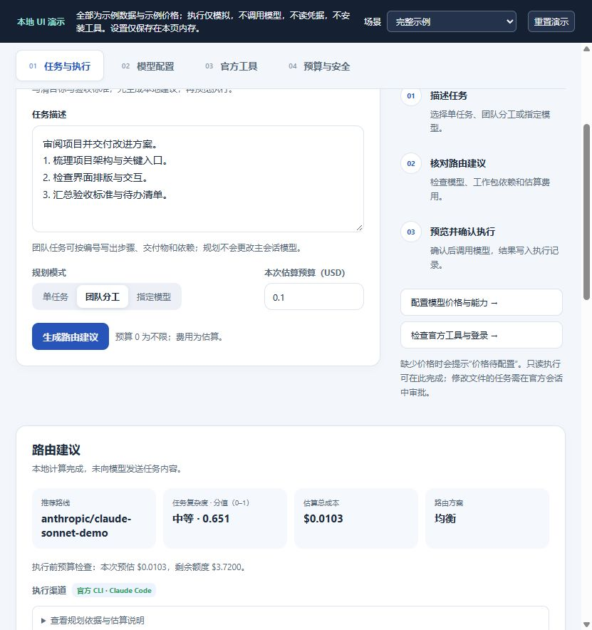

# Model Router · DeepSeek Harness 模型路由插件

版本：**0.16.3**。选模求解器概览见[路由研究说明](docs/ROUTING_RESEARCH.zh.md)；公式、条件证明与实验见[数学推导与实验记录](docs/ROUTING_DERIVATION_EXPERIMENTS.zh.md)。[LiveBench 最新证据与验证协议](docs/ROUTING_LIVEBENCH_VALIDATION.zh.md)已核查 2026-06-25 聚合评分/费用；最新逐题质量—费用矩阵尚未取得，不声称真实路由收益。

为 **DeepSeek Harness Desktop** 提供任务规划、成本感知的模型分配和官方工具执行工作台。输入任务，比较已配置模型，审阅计划，再明确选择是否执行。

**0.16.3**：恢复全部官方工具卡片的检测和安装。Windows 上的探测与 `npm` 再次按独立参数启动，避免 cmd 把 Node 指到不存在的脚本。只要输出版本号就视为已安装；单张卡片的检测错误留在该行；已经是最新版的 CLI 不再被收成「修复官方执行入口」。

**0.16.2**：官方工具的更新/安装按钮会保留本次点击启动的任务；已有探测结果时重新体检不再把按钮禁用成无响应；点击无法开始、或安装后探测版本仍低于最新版时，在该行显示错误。已安装的 Claude Code 先执行 `claude update`，再按注册表走 npm；已安装的 Windows MiniMax 走官方安装脚本。

**0.16.1 成熟度改进**：稳定反馈缓存、分模型/任务解释、刷新与设置竞态保护，以及费用历史不可读取或不完整时的预算门禁。[推导与验证](docs/ROUTING_MATURITY.zh.md)随安装包提供，机制测试不等于真实质量—成本收益。

**0.16.0 新增**：[动态数据与持续反馈](docs/ROUTING_ADAPTIVE_LEARNING.zh.md)：可选公开价格/LiveBench快照刷新；按任务类型、时间衰减和低样本收缩调整个人偏好，质量门槛独立保留。设置在“预算与安全”，公开源默认关闭；价格源需提供按官方文档核对的固定USD单价JSON，不是通用官网抓价器。本地DSH_HOME共享、最近200运行窗口，暂无真实收益证明。

当前版本为 **0.16.3**，包名为 `@ljwei-stak/dsh-model-router`；声明兼容的宿主为 **DeepSeek Harness Desktop 0.2.0-rc.1 / 0.2.0-rc.2**。自 0.12.0 起，路由与 [GAL](https://github.com/Alice-Marx/deepseek-harness-galgame) 已拆成两个独立插件。

**0.15.0 更新**：工作台分为四页，路由建议紧接任务规划展示；执行输入变化时丢弃旧预览；裁剪历史或重试后仍保留费用累计；源码开发新增独立模拟 UI 预览。

[English](README.md) · [工作台完整指南](docs/WORKBENCH_USER_GUIDE.zh.md) · [安装与验证](INSTALLATION_GUIDE.zh.md) · [迁移说明](MIGRATION.md) · [更新记录](CHANGELOG.md)

需要自行实测时，按[安装验收与质量—成本实验步骤](docs/ROUTING_SELFTEST_STEPS.zh.md)先完成桌面检查和 18 题×3 模型小样，再决定正式样本与费用上限。方案区分首包选模投影和实际团队执行；配套离线入口不采集、不调用模型，真实收益仍待验证。

## 当前功能

| 功能 | 实际行为 |
| --- | --- |
| 任务规划 | 本地分析任务类型与复杂度；生成单路线建议、带依赖的团队工作包，或直接指定一个已配置模型。 |
| 模型配置 | 读取 Harness 官方目录中的准确 `provider/model`；可填写自报质量、美元单价、专长、CLI 模型名、执行与计费偏好。 |
| 路由方案 | 省钱优先、均衡、效果优先；按质量门槛、预估 token 成本与有限组合搜索分配模型。未知价格保持未知。 |
| 只读执行 | 工作台先预览、再确认执行；也可在官方会话调用工具。支持的无界面 CLI 或模型目录 API 返回结果并留存记录。 |
| 可编辑执行 | 通过官方会话启动单个 CLI 或顺序 CLI 团队，经审批在独立 Git 工作树修改，满足条件后整合补丁。 |
| 官方工具 | 八个固定注册表工具的检测、安装/更新、可信入口与登录体检；安装有日志和取消操作。 |
| 交互终端 | 系统终端/PowerShell 与七个 CLI，含固定登录命令、多会话和实时输出。 |
| 成本与订阅 | 每日/月度预算检查、自动尝试省钱方案或暂停、订阅优先、额度冷却，以及其他订阅失败的确认流程。 |
| 执行与质量记录 | 逐工作包结果、依赖图、失败详情、重跑/改派、用户评价与可选强模型复核。 |
| 执行边界 | 显示每条路线可读/可写范围，以及是否经过 Harness 进程沙箱。 |

**生成路由建议在本机完成，不启动 CLI，也不调用付费模型。实际执行可能产生费用。**


## 安装到 Harness Desktop

打开 **插件 → 添加插件**，填写：

```text
@ljwei-stak/dsh-model-router@0.16.3
```

镜像缺少该精确版本时使用官方 HTTPS npm 源 `https://registry.npmjs.org/`。安装并启用后，完全退出 Harness（包括托盘进程）再启动。插件详情应显示 **0.16.3**，侧栏出现**模型路由**。仅运行全局 `npm install -g` 不会把插件注册到桌面版 profile。

也可在插件管理器填写本地 `.tgz` 文件的绝对路径，或解压后的内层 `package` 目录；其中应包含 `package.json` 与 `.dsh-plugin`。[历史发布页](https://github.com/Alice-Marx/dsh-model-router/releases)提供归档；已克隆源码的开发方式见下文。

### 从旧包名升级

`@ljwei-stak/model-router-galgame` 的最后版本为 0.13.0。保留 profile 与应用数据，移除旧插件条目，再添加 `@ljwei-stak/dsh-model-router@0.16.3`。不要同时安装两个包：它们共用内部插件 id `model-router-galgame` 与工具名；id 保留使已有路由设置和执行历史能够延续。

从 0.11.x 合并版迁移时，先备份 profile 并导出希望保留的 GAL 进度。剧情、立绘、音乐、自由模式和存档属于独立 `@ljwei-stak/dsh-galgame` 插件。导出范围及同 profile 迁移的限制见 [MIGRATION.md](MIGRATION.md)。

## 工作台的四个页面

0.15.0 工作台顶部概览显示已登记模型、工具检测和今日已记录 API 费用。按用途切换页面：

| 页面 | 操作内容 |
| --- | --- |
| **任务与执行** | 写任务、选规划模式、生成建议、预览只读执行、查看逐步骤历史。 |
| **模型配置** | 刷新/搜索官方模型目录，编辑每条准确路线的能力与价格档案。 |
| **官方工具** | 完成首次体检，检测/安装工具，使用交互终端。 |
| **预算与安全** | 设置路由、预算、复核策略，查看订阅状态和执行范围。 |

页面切换保留已挂载面板，安装任务和终端会话状态持续保留。



*本地 UI 演示实拍，使用示例模型、价格与体检数据；未调用真实模型或连接 Harness。团队工作包可展开查看目标、依赖和验收项。*

1. 先在 Harness 官方**模型**页配置供应商、模型和凭据。在**模型配置**页刷新目录。目录有记录不代表凭据、网络和模型权限已经可用。
2. 为参与比较的路线填写可选档案。质量分为你提供的 **0–100** 估值；输入/输出单价单位是 **USD / 百万 token**。不知道价格就留空，不要把未知填成零。
3. 在**任务与执行**写清交付物、约束与验收标准。**单任务**推荐一条路线；**团队分工**为足够复杂的任务拆依赖工作包；**指定模型**直接选一个准确路线，跳过其他模型比较。选团队模式不会自动启动团队。
4. 设置本次估算目标；`0` 表示不限制本次规划。点**生成路由建议**，结果直接出现在任务规划后方。核对路线、复杂度、费用、执行渠道，以及每包依赖和验收清单。
5. 需要实际只读执行时，使用**在工作台执行**，填写存在的工作区绝对路径（留空沿用上次运行）。先点**预览执行计划**，审阅当前路线和所有确认项，再明确确认执行。宿主启动前会再次检查；状态变化时可能要求重新确认。
6. 在**执行记录与子任务**查看实际通道、回答、错误、费用与评价。需要 CLI 修改文件时，在 Harness 官方会话中调用下方可编辑工具。

更改任务、模式、模型档案、目录或相关设置后，需要重新生成建议。更改执行输入会丢弃正在请求或已经返回的旧预览，必须重新预览当前请求才能确认执行。执行预览采用宿主当前状态，因此可能与早先的本地建议不同。

示例任务：

```text
审阅当前项目并制定改进计划。
1. 梳理入口文件与主要 UI 流程。
2. 检查宽屏和窄屏排版，列出布局问题。
3. 核查执行、订阅和费用边界。
4. 整合为带优先级、改动范围和验证方法的清单。
```

插件负责规划及委派文字/代码任务；它本身不渲染视频、生成图片或控制创作软件。完整操作见[工作台指南](docs/WORKBENCH_USER_GUIDE.zh.md)。

## 官方会话工具

在官方 Harness 会话里明确请求使用这些工具；访问本地文件前先选择正确工作区。

| 工具 | 作用 |
| --- | --- |
| `model_router_routes` | 列出官方已配置路线；不验证账号和网络。 |
| `model_router_plan` | 本地生成 `single` 或 `team` 计划。 |
| `model_router_consult` | 通过模型 API 向一个已配置模型征求意见，可能计费。 |
| `model_router_execute` | 只读执行路由计划，或执行明确指定的 `provider`/`model`，并留存结果。 |
| `model_router_tools` / `model_router_health` | 检查安装/入口，或体检版本、登录与计费状态。 |
| `model_router_tool_install` | 从固定官方来源安装一个注册表工具。 |
| `model_router_tool_run` | 运行单个支持的 CLI，选择只读或经审批的可编辑模式。 |
| `model_router_team_execute` | 按当前可执行 CLI 重新规划，按依赖顺序执行工作包。 |
| `model_router_rerun_step` | 重跑失败步骤及未完成下游，续跑符合条件的可编辑团队，或再次执行失败的单工具调用。 |
| `model_router_rate` | 为某个结果记录 `up`、`down`、`clear`。 |

会话命令为 `/router <任务>`、`/tools`、`/tools install|cancel <工具 ID>`。

只生成计划的参数示例：

```json
{"task":"评审项目架构并给出验收清单","mode":"team","budgetUsd":10}
```

单个 CLI 只读检查示例：

```json
{"tool":"codex","task":"检查仓库 UI 排版并列出问题；不要修改文件","mode":"read-only"}
```

指定目录路线时，`provider` 与 `model` 必须成对填写。厂商 CLI 模型名可能与 Harness ID 不同；只有在对应 CLI 验证后才设置 `cliModel` 或团队 `cliModelsJson`。ZCode 使用自身默认模型，不能逐次切换。多数 CLI 不回报可核验的实际模型 ID，需对照厂商运行记录。

CLI 团队是插件自有的顺序依赖执行器。Harness 内建 Agent Teams 的成员模型与生命周期仍由宿主管理。

## 官方工具与托管模式

| 注册表 ID | 工具 | 单工具/团队托管模式 |
| --- | --- | --- |
| `kimi-code` | Kimi Code | 经审批的 `workspace-write` |
| `claude-code` | Claude Code | `read-only`、经审批的 `workspace-write` |
| `codex` | Codex CLI | `read-only`、经审批的 `workspace-write` |
| `minimax-code` | MiniMax Code | 经审批的 `workspace-write` |
| `mimo-code` | MiMo Code | `read-only`、经审批的 `workspace-write` |
| `grok-build` | Grok Build | `read-only`、经审批的 `workspace-write` |
| `gemini` | Gemini CLI | 路由执行的无界面适配器；不属于单工具/团队托管执行器 |
| `zcode` | ZCode | Windows；经审批的 `workspace-write` |

安装使用固定官方 npm 包的 `@latest`，或 ZCode 官方、经过发布者签名验证的 Windows 安装器。已安装版本比查询到的最新版更高时不会降级。最新版查询缓存约 12 小时；离线/查询失败时保持未知。厂商新版本没有自动获得本项目验证。ZCode 打开安装窗口后，仍需手动选目录并完成安装。

**已安装、可信入口就绪、账号已登录、模型有权限是不同状态。** 登录未知不代表已退出。在 Windows，托管入口按发布者签名或官方 npm tarball 校验；ZCode 另对签名构建中的脚本记录首次信任摘要。平台细则见[注册表](.dsh-plugin/shared/official-tool-registry.mjs)和[执行器](.dsh-plugin/shared/official-tool-executor.mjs)。

`model_router_execute` 的固定无界面适配器为 Claude、Codex 和 Gemini；其他供应商经模型目录 API 或适用的订阅路线执行。CLI 缺失/不可用时可回退 API；真正尝试后的订阅失败按下方策略处理。

可编辑执行要求干净 Git 仓库、Harness 审批与进程沙箱。修改先在独立工作树进行，执行成功且原仓库仍干净并匹配时才整合源码补丁；执行或整合失败会明确报告。Git 忽略的输出另行检查。只读参数不一定把可读文件限制在工作区，尤其需在**安全边界**核对 Codex 的较大可读范围。

### 官方工具终端

在**官方工具 → 官方工具终端**选择系统终端或已安装 CLI、交互/登录方式和存在的工作区绝对路径，核对启动确认后运行。ZCode 是桌面应用，不属于终端目标。

终端**不经过 Harness 沙箱**，继承 Host 用户的登录环境、代理及 API Key 环境变量。输入的命令可以按该用户权限读取/修改文件。终端与路由执行的审批和计费流程分别处理。

可选依赖 `@lydell/node-pty` 提供真实伪终端；加载失败时显示管道模式，全屏界面、尺寸同步与方向键可能不可用。最多同时运行四个会话；无人读取约两分钟会结束，单会话最长六小时。完成后明确结束会话；关闭工作台或卸载插件也会终止进程。

插件不持久化终端输入/输出，仅保存会话元数据。选中文字时 Ctrl+C 复制，否则中断；Ctrl+Shift+V 粘贴。

## 成本、订阅与质量

- **预算**：本次规划目标与每日/月度执行检查分别生效。超预算可尝试省钱方案或暂停确认；缺少价格保持费用未知。它们是本机估算与核算机制，不是厂商账单的硬上限。
- **订阅优先**：默认先使用检测到的 CLI 订阅账号或配置的编程套餐路线。尝试 CLI 订阅时去掉 API Key 环境变量。`billing` 可设 `subscription-first`、`api-only`、`subscription-only`；`subscription` 可设 `cli-login`、`plan-key`、`none`。
- **回退**：识别到额度用尽/限流后，将订阅标记为冷却，并可按策略及可用性用已配置 API 路线重试该路由步骤。其他已尝试的订阅失败默认暂停（`onSubscriptionFailure: "ask"`），在历史中选择 API 重试、重试订阅或取消。单工具/团队托管执行不会自动转 API 重试。
- **核算**：API 费用计入预算；订阅单独展示按 API 单价折算的参考费用。实际用量可来自 CLI 自报金额，或 token 用量乘你提供的单价；真实消费以厂商账单为准。0.15.0 保留被裁剪历史和被重试结果替换的费用累计，避免重跑或清理详细历史抹掉此前消费；旧版本已经丢弃的费用无法反推恢复。
- **质量与偏好**：强模型复核可设 `off`、`sample`、`always`，会增加真实调用，但不作为人工反馈。明确评价按准确路线和任务类型，以时间衰减及低样本收缩调整独立主观效用（默认上限 ±0.04，可配置至 ±0.1）；不修改客观质量分或质量硬门槛。可停用学习、撤回评价或重置学习起点。

编程套餐 Key 与端点留在 Harness 官方供应商设置里。`plan-key` 档案可指定一个准确、已登记的 `apiRoute` 作为回退；模型档案不接收凭据或任意命令。套餐资格及使用条款须向厂商核对。

## 路由算法：从输入到分配

这是可重复的本地启发式规划，不是对任务成功率的保证：

1. 根据文本估计任务类型/复杂度，必要时拆成分析、执行、验证、整合工作包。
2. 仅比较官方已配置路线，覆盖准确路线的用户档案，并尽可能筛选模态和质量约束。
3. 按路由方案比较质量、预估价格、延迟、专长、推理适配与风险。
4. 剪除被其他路线支配的候选，在有限范围搜索依赖分配；质量约束放宽、证据不足和无法分配的包会显示提示。

预估费用为 token 用量乘 USD/百万 token 单价，支持可选缓存价。质量资料可能来自用户、提供的基准数据或目录启发式，目录提示不等于实测成功率。图像路线仍需真实输入能力；当前路由执行以文本为主，不是通用多模态素材制作流水线。

实现见 [router.mjs](.dsh-plugin/shared/router.mjs)、[harness-plan.mjs](.dsh-plugin/shared/harness-plan.mjs) 和 [routing-presets.mjs](.dsh-plugin/shared/routing-presets.mjs)。

## 数据保存与隐私

模型档案和偏好保存在 Harness 插件设置中。运行状态位于 `<DSH_HOME>/model-router/state.json`，默认 `~/.dsh/model-router/state.json`；包括体检/引导、订阅冷却、评价、最多 200 条近期运行、50 条终端元数据与可选公开数据快照。运行记录冻结当时费率及数据/反馈策略版本。偏好在该本地DSH_HOME共享，不是经认证的账号隔离；公开数据请求不上传任务或反馈。

0.15.0 还保存最多 90 个有记录的日期和 24 个月的费用汇总，仅包含金额/次数，不包含任务或回答内容。

执行历史含任务文本、回答摘录、路线、工作区、错误及费用。保存的任务最多 20,000 字符，每个回答最多 4,000 字符；重跑可能依赖截断后的上下文。模型档案不保存 API Key，终端不保存交互内容。实际执行仍会把所选任务/上下文发送给相应供应商或 CLI。

状态写入使用文件锁和原子替换；无法解析的文件保留为 `state.json.corrupt-<时间>` 并提示。迁移前备份状态/profile；分享历史或日志时先脱敏。

## 从克隆源码开发

Git 仓库包含完整源码；npm 包是运行分发，不包含客户端源码、脚本、测试和实验工程。

需要 **Node.js 22.19+**、**pnpm 10.34.6**（`packageManager` 已固定）。在包含克隆目录的 PowerShell 中运行：

```powershell
cd .\dsh-model-router
pnpm install --frozen-lockfile --strict-peer-dependencies
npm run build:client
npm test
npm run check:client
npm run pack:local
```

已在仓库目录时跳过第一行。安装包输出到 `dist`，在测试 profile 的桌面插件管理器中填写其绝对路径。单元测试通过不代表厂商登录、实际模型身份和扣费已验证。

无需启动 Harness 或厂商工具即可查看 UI：

```powershell
npm run preview:ui
```

打开[本地预览](http://127.0.0.1:4173)。它使用模拟模型、工具和历史，提供有数据、空目录、错误、首次引导和延迟预览场景，用于检查布局和交互。模拟执行不调用供应商、不安装工具、不启动真实终端；它不等于 Host 集成验收。默认端口占用时可运行 `npm run preview:ui -- --port 4174`；修改客户端源码后刷新页面即可查看。

| 位置 | 用途 |
| --- | --- |
| `.dsh-plugin/index.mjs` | Host 插件、会话工具、设置、执行与远程处理。 |
| `.dsh-plugin/client/` | React 工作台源码与 CSS。 |
| `.dsh-plugin/shared/` | 路由、工具注册表/执行、计费、历史、状态与终端协议。 |
| `.dsh-plugin/client.js` | 生成的桌面客户端；修改客户端源码后需要重建。 |
| `scripts/` 与 `tests/` | 构建、打包、验证辅助脚本与回归测试。 |
| `experiment-plugin/` | 独立研究实验工程，不随当前路由插件发布。 |
| `docs/` 与带日期报告 | 用户文档与历史验证记录。 |

`check:client` 在内存中重建并核对生成文件，`prepack` 会拒绝过期的客户端。pnpm 10 没有 `pnpm peers check`，使用上面的严格依赖安装。不可获取或不兼容的宿主 SDK 可影响本地集成验证；[setup-harness-dev.mjs](scripts/setup-harness-dev.mjs) 从明确指定的已安装 Host `node_modules` 链接缺少的 SDK，[start-harness-preview.mjs](scripts/start-harness-preview.mjs) 启动独立本地 Web Host profile。这些辅助方式不替代依赖核验与真实桌面验收。

旧兼容模块、研究资料和带日期报告保留供参考，不表示其中所有旧集成都在当前插件中启用。发布与同步遵循 [AGENTS.md](AGENTS.md)；复现发布内容时使用精确版本的包或经过验证的发布标签。

## 常见问题

| 情况 | 检查 |
| --- | --- |
| 没有路线/无法规划 | 先配置官方模型页，刷新目录，并等待工具检测结束。 |
| 费用未知 | 为比较的路线同时填写输入/输出 USD 单价。 |
| 工具已安装但不能执行 | 查看可信入口原因、平台/模式支持和安装来源。 |
| 登录/模型调用失败 | 核查厂商账号、CLI 登录、网络和模型权限；安装成功不等于可用。 |
| 提示后台版本较旧 | 完全退出 Harness（包括托盘），再启动。 |
| 预览与旧建议不同 | 目录、登录、额度或预算变化；重新审阅预览。 |
| 终端全屏界面不显示 | 检查使用 PTY 还是管道回退。 |
| 可编辑团队停止 | 先核对失败工作包与整合状态，再选择续跑或人工审阅工作树。 |

反馈请附宿主/插件版本、执行模式、工具状态和脱敏错误：[问题反馈](https://github.com/Alice-Marx/dsh-model-router/issues)。

许可证：[MIT](LICENSE)。
